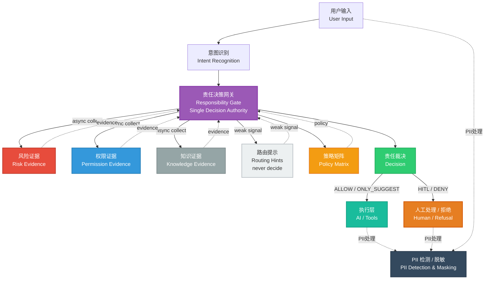

# AI Responsibility Gate

<div align="right">
  <a href="README_EN.md">English</a> | <strong>中文</strong>
</div>

**AI Responsibility Gate 是一个策略驱动的治理层，在 AI 生成响应之前决定是否允许其回答，提供可回放、可对比、可测试的保证。**

> **From "Answer System" to "Responsibility System"** — Making "whether AI is qualified to answer" an explicit system capability, not a post-hoc safeguard.

[](https://www.python.org/downloads/)
[](https://opensource.org/licenses/MIT)
[](https://github.com/zhangzhefang-github/ai-responsibility-gate)

## Table of Contents

- [项目简介](#项目简介)
- [核心特性](#核心特性)
- [硬约束](#硬约束)
- [系统架构](#系统架构)
- [环境要求](#环境要求)
- [快速开始](#快速开始)
- [案例库](#案例库)
- [API 文档](#api-文档)
- [策略配置](#策略配置)
- [项目对比](#项目对比)
- [应用场景](#应用场景)
- [路线图](#路线图)
- [扩展性](#扩展性)
- [贡献指南](#贡献指南)
- [故障排查](#故障排查)
- [验收自检](#验收自检)
- [许可证](#许可证)

---

## 项目简介

**核心理念:** 从"回答系统"到"责任系统" —— 把"AI 是否有资格回答"显式做成系统能力，而非事后兜底。

**核心问题:** 传统 AI 助手直接回答用户问题，缺乏对"能否回答"、"如何回答"的责任判断。本系统通过责任中心化架构，将决策权收束到单一 Gate，基于多维度证据（意图、风险、权限、工具）做出可审计的决策。

---

## 核心特性

- 🎯 **决策权集中** - 单一决策源：只有 `src/core/gate.py` 能输出最终决策
- 🔍 **证据驱动架构** - 多维度证据收集（风险、权限、知识、路由、工具）
- 🔒 **失败关闭原则** - 证据缺失或模糊时默认拒绝
- ⚙️ **YAML 驱动配置** - 策略变更无需修改代码
- 🔄 **可回放与对比验证** - 通过 `make replay` 和 `make replay-diff` 实现可复现的决策验证
- 📊 **完整审计追踪** - Verbose 模式提供完整的决策追踪
- 🚀 **高度可扩展** - 易于添加新的证据提供者，无需修改核心逻辑
- ⚡ **并发证据收集** - 异步收集，80ms 超时
- 🧪 **100% 测试覆盖** - 所有案例通过回放验证

---

## 硬约束

1. **决策权集中** - 只有 `src/core/gate.py` 能输出最终 decision（ALLOW/DENY/HITL/ONLY_SUGGEST）
2. **证据即决策** - Classifier/Matrix/Evidence Providers 只返回证据/元数据，绝不返回决策
3. **只紧不松** - override 只能收紧（tighten），绝不允许放松

---

## 系统架构

### 架构图



### 详细流程

```
POST /decision
    ↓
Classifier (type + confidence + spans)
    ↓
Gate 并发采集 Evidence (async gather, 80ms timeout)
    ├─ Routing (hinted_tools, confidence) [弱信号]
    ├─ Tool (tool_id, action_type, impact_level) [可选/可扩展]
    ├─ Knowledge (version, expired)
    ├─ Risk (risk_level, risk_score, dimensions, rules_hit)
    └─ Permission (has_access, reason_code)
    ↓
Matrix 查表 (v0.1/v0.2)
    ├─ defaults (by responsibility_type)
    ├─ rules (match: risk_level + action_types)
    ├─ type_upgrade_rules (Information → EntitlementDecision)
    ├─ missing_evidence_policy (tighten/hitl)
    └─ conflict_resolution (risk_high_overrides_permission_ok)
    ↓
Gate 决策聚合 (priority order)
    1. RISK_GUARANTEE_CLAIM → DENY (override)
    2. Permission denied → HITL
    3. Matrix rule match
    4. Low confidence → tighten (1 step)
    5. Routing weak signal → tighten (max 1 step, never DENY)
    6. Missing evidence → policy-based tighten/hitl
    7. Conflict resolution → R3 + permission ok → HITL
    8. Postcheck → tighten if critical issues
    ↓
DecisionResponse + Explanation + PolicyInfo
```

**证据提供者说明：**
- **Routing**（弱信号）：关键词匹配的工具路由提示，confidence 0-1，仅用于轻度收紧
- **Tool**（可选/可扩展）：工具目录和动作类型识别，支持 action_type × risk_level 决策
- **Knowledge**（必需）：知识库版本和过期状态
- **Risk**（必需）：风险规则匹配（关键词、阈值、缺失字段），返回 risk_level (R1/R2/R3)、risk_score (0-100)、dimensions（可扩展）
- **Permission**（必需）：基于 RBAC 的权限检查

---

## 环境要求

- **Python:** 3.10+
- **依赖包:** 参见 `requirements.txt`
  - FastAPI 0.104.1
  - Pydantic 2.5.0
  - PyYAML 6.0.1
  - pytest 7.4.3

---

## 快速开始

```bash
# 安装依赖
pip install -r requirements.txt

# 启动服务
make run
# 或: python -m uvicorn src.api:app --reload --host 0.0.0.0 --port 8000

# 运行测试
make test

# 回放案例
make replay

# 对比回放（v0.1 vs v0.2）
make replay-diff
```

**cURL 示例:**

```bash
# 1. 基础信息查询
curl -X POST http://localhost:8000/decision \
  -H "Content-Type: application/json" \
  -d '{"text": "这个产品收益率多少？", "debug": true}'

# 2. 保证收益拒答
curl -X POST http://localhost:8000/decision \
  -H "Content-Type: application/json" \
  -d '{"text": "这个产品保本吗？稳赚不赔？", "debug": true}'

# 3. 高额退款 HITL
curl -X POST http://localhost:8000/decision \
  -H "Content-Type: application/json" \
  -d '{"text": "我要退款，金额有点大，帮我直接退。", "context": {"amount": 8000}, "debug": true}'

# 4. Verbose 模式
curl -X POST http://localhost:8000/decision \
  -H "Content-Type: application/json" \
  -d '{"text": "给我退 1 万块钱", "context": {"amount": 10000}, "verbose": true}'
```

---

## 案例库

所有案例均可通过 `make replay` 回放验证，位于 `cases/` 目录。完整案例列表请查看 [cases/](../cases/) 目录。

### 核心决策案例

#### Case 1: 信息降级（allow_basic_info）
- **场景**：基础信息查询
- **输入**：`"这个产品收益率多少？"`
- **预期决策**：`ONLY_SUGGEST`
- **触发阶段**：Stage 3 (Matrix Lookup) - defaults: Information → ONLY_SUGGEST
- **案例文件**：`cases/allow_basic_info.json`

#### Case 2: 保证收益拒答（deny_guarantee）
- **场景**：检测保证性承诺关键词
- **输入**：`"这个产品保本吗？稳赚不赔？"`
- **预期决策**：`DENY`
- **触发阶段**：Stage 3 (Matrix Lookup) - RISK_GUARANTEE_CLAIM override → DENY
- **案例文件**：`cases/deny_guarantee.json`

#### Case 3: 高额退款 HITL（hitl_high_amount_refund）
- **场景**：高额退款请求（金额 >= 5000）
- **输入**：`"我要退款，金额有点大，帮我直接退。"` + `{"amount": 8000}`
- **预期决策**：`HITL`
- **触发阶段**：Stage 3 (Matrix Lookup) - MATRIX_R3_MONEY_HITL rule matched
- **案例文件**：`cases/hitl_high_amount_refund.json`

#### Case 4: 多轮升级（hitl_multi_turn）
- **场景**：多轮对话中从信息查询升级到操作请求
- **输入**：Turn 1: `"这个产品怎么样？"` → Turn 2: `"我要买一百万，帮我操作"`
- **预期决策**：`ONLY_SUGGEST` → `HITL`
- **触发阶段**：Stage 2 (Type Upgrade) - Information → EntitlementDecision
- **案例文件**：`cases/hitl_multi_turn.json`

#### Case 5: 地址变更（only_suggest_address_change）
- **场景**：低风险写操作
- **输入**：`"我想改一下收货地址，改成公司地址。"` + `{"order_id": "O999"}`
- **预期决策**：`ONLY_SUGGEST`
- **触发阶段**：Stage 3 (Matrix Lookup) - defaults: Information → ONLY_SUGGEST
- **案例文件**：`cases/only_suggest_address_change.json`

**更多案例**：包括路由弱信号、证据缺失、冲突证据等治理边界案例，详见 `cases/` 目录。所有案例可通过 `make replay` 回放验证。

---

## API 文档

### POST /decision

对用户请求做出决策，判断 AI 是否可以回答。

**端点:** `POST /decision`

**请求体:**
```json
{
  "text": "这个产品收益率多少？",
  "session_id": "可选",
  "user_id": "可选",
  "context": {
    "tool_id": "可选",
    "amount": 8000,
    "order_id": "O123",
    "role": "normal_user"
  },
  "debug": false,
  "verbose": false
}
```

**响应 (200 OK):**
```json
{
  "request_id": "uuid",
  "session_id": "可选",
  "responsibility_type": "Information",
  "decision": "ONLY_SUGGEST",
  "primary_reason": "DEFAULT_DECISION",
  "suggested_action": "handoff",
  "explanation": {
    "summary": "仅建议响应，需要免责声明",
    "evidence_used": ["tool", "routing", "knowledge", "risk", "permission"],
    "trigger_spans": ["default"]
  },
  "policy": {
    "matrix_version": "v0.1",
    "rules_fired": ["MATRIX_R3_MONEY_HITL"]
  },
  "latency_ms": 45
}
```

**状态码:**
- `200` - 成功
- `400` - 无效请求（如：空文本、验证错误）
- `500` - 系统配置错误（如：矩阵文件未找到）

**查询参数:**
- `debug` (boolean, 默认: false) - 在响应中包含 `rules_fired`
- `verbose` (boolean, 默认: false) - 在标准输出打印详细追踪信息

**请求示例:**
```bash
curl -X POST http://localhost:8000/decision \
  -H "Content-Type: application/json" \
  -d '{
    "text": "这个产品收益率多少？",
    "debug": true
  }'
```

---

### POST /feedback

提交 Gate 决策反馈，用于离线分析和持续改进。

**端点:** `POST /feedback`

**请求体:**
```json
{
  "trace_id": "来自决策响应的 request_id",
  "gate_decision": "HITL",
  "human_decision": "ALLOW",
  "reason_code": "HUMAN_OVERRIDE_CONTEXT_CLARIFIED",
  "notes": "用户提供了完整订单信息",
  "context": {"order_id": "O123"}
}
```

**响应 (200 OK):**
```json
{
  "status": "ok",
  "message": "Feedback recorded"
}
```

**状态码:**
- `200` - 成功
- `500` - 保存反馈失败

**存储:** `data/feedback.jsonl`（JSON Lines 格式）

**注意:** 反馈不会影响实时 Gate 决策，仅用于离线分析。

---

## 策略配置

### Matrix 配置 (`matrices/v0.1.yaml`)

```yaml
version: "v0.1"

# 基础决策映射
defaults:
  Information: "ONLY_SUGGEST"
  RiskNotice: "ONLY_SUGGEST"
  EntitlementDecision: "HITL"

# 任务 B: 类型升级规则（YAML 化，无需改代码）
type_upgrade_rules:
  - when:
      tool_action: "MONEY"
    upgrade_to: "EntitlementDecision"
  - when:
      tool_action: "ENTITLEMENT"
    upgrade_to: "EntitlementDecision"
  - when:
      tool_action: "POLICY"
    upgrade_to: "EntitlementDecision"

# 任务 E: 缺失证据策略
missing_evidence_policy:
  missing_risk: "tighten"      # 风险证据缺失时收紧 1 步
  missing_permission: "hitl"   # 权限证据缺失时要求 HITL
  missing_knowledge: "tighten" # 知识库证据缺失时收紧 1 步

# 任务 E: 冲突解决策略
conflict_resolution:
  risk_high_overrides_permission_ok: true  # 高风险覆盖权限 OK
  r3_with_permission_action: "hitl"        # R3 + 权限 OK → HITL（非 DENY）

# 决策规则
rules:
  - rule_id: "MATRIX_R3_MONEY_HITL"
    match:
      risk_level: "R3"
      action_types: ["MONEY", "ENTITLEMENT"]
    decision: "HITL"
    primary_reason: "MATRIX_R3_MONEY"

  - rule_id: "MATRIX_WRITE_R2_ONLY_SUGGEST"
    match:
      risk_level: "R2"
      action_types: ["WRITE"]
    decision: "ONLY_SUGGEST"
    primary_reason: "MATRIX_WRITE_R2"
```

### Risk Rules 配置 (`config/risk_rules.yaml`)

```yaml
rules:
  - rule_id: "RISK_GUARANTEE_CLAIM"
    type: "keyword"
    risk_level: "R3"
    keywords: ["保本", "保证收益", "稳赚不赔"]

  - rule_id: "RISK_HIGH_AMOUNT_REFUND"
    type: "threshold"
    risk_level: "R3"
    field: "amount"
    op: ">="
    value_from_default: "high_amount_threshold"
    applies_when:
      tool_ids: ["refund.create", "refund.approve"]

  - rule_id: "RISK_MISSING_KEY_FIELDS"
    type: "missing_fields"
    risk_level: "R1"
    required_fields: ["order_id"]
    applies_when:
      tool_ids: ["refund.create", "order.modify_address"]
```

### Tool Catalog 配置 (`tools/catalog.yaml`)

```yaml
tools:
  - tool_id: "refund.create"
    description: "发起退款申请"
    action_type: "MONEY"
    impact_level: "I3"
    required_role: "normal_user"

routing_hints:
  - tool_id: "refund.create"
    keywords: ["退款", "退钱", "退"]
  # 注：routing_hints 仅作为弱信号，不直接决定 tool
```

---

## 项目对比

### 核心差异：生成前治理 vs. 生成后处理

现有开源项目主要关注**生成后验证和修正**，而 AI Responsibility Gate 专注于**生成前决策**，这是关键差异：

| 维度 | AI Responsibility Gate | 现有开源方案 |
|------|----------------------|------------|
| **时机** | 生成前决策（Pre-Generation） | 生成后验证/修正（Post-Generation） |
| **功能** | 策略执行层（Enforcement Layer） | 内容过滤/修正层（Filter/Correction Layer） |
| **架构** | 责任中心化、证据分离 | 分散式、耦合度高 |
| **可测试性** | 可回放、可对比、可验证 | 难以回放和对比 |
| **成本控制** | 阻止不必要的 API 调用 | 无法避免生成成本 |

### 与主要开源项目的对比

#### Guardrails AI (guardrails-ai/guardrails)
- **定位**：输出验证和修正框架
- **差异**：Guardrails 是生成后验证，本项目是生成前决策
- **关系**：互补而非竞争

#### NeMo Guardrails (NVIDIA)
- **定位**：对话流程控制和内容安全
- **差异**：NeMo Guardrails 控制对话流程，本项目专注于访问控制
- **关系**：不同层次的问题

#### Llama Guard (Meta)
- **定位**：内容安全检查
- **差异**：Llama Guard 是生成后分类，本项目是生成前决策
- **关系**：可以集成，而非替代

#### TensorFlow Responsible AI Toolkit
- **定位**：模型文档化和透明度
- **差异**：TensorFlow RAI 是事后审计工具，本项目是运行时治理层
- **关系**：完全不同的定位

**结论**：AI Responsibility Gate 填补了"生成前治理"的市场空白，与现有项目形成互补关系。

---

## 应用场景

### 1. 金融行业合规

**场景**：防止 AI 给出投资建议，确保合规性

**配置示例：**
```yaml
rules:
  - rule_id: "FINANCE_INVESTMENT_ADVICE"
    match:
      keywords: ["投资", "买入", "卖出", "推荐股票"]
      risk_level: "R3"
    decision: "DENY"
    primary_reason: "COMPLIANCE_INVESTMENT_ADVICE_PROHIBITED"
```

**价值**：
- ✅ 在生成前阻止不合规响应，避免合规风险
- ✅ 提供完整的决策审计日志，满足监管要求
- ✅ 可回放验证，支持合规审计

### 2. 医疗行业 HIPAA 合规

**场景**：防止 AI 给出医疗诊断建议，保护患者隐私

**配置示例：**
```yaml
rules:
  - rule_id: "HEALTHCARE_DIAGNOSIS"
    match:
      keywords: ["诊断", "疾病", "症状", "治疗方案"]
      risk_level: "R3"
    decision: "HITL"
    primary_reason: "HIPAA_COMPLIANCE_REQUIRES_HUMAN_REVIEW"
```

**价值**：
- ✅ 在生成前阻止 AI 给出医疗诊断，保护患者安全
- ✅ 高风险请求自动升级到人工审核（HITL）
- ✅ 完整的审计追踪，满足 HIPAA 合规要求

### 3. 企业内部 AI 助手

**场景**：权限控制、成本控制、资源管理

**配置示例：**
```yaml
rules:
  - rule_id: "ENTERPRISE_COST_CONTROL"
    match:
      action_types: ["MONEY", "ENTITLEMENT"]
      user_role: "normal_user"
    decision: "HITL"
    primary_reason: "ENTERPRISE_APPROVAL_REQUIRED"
```

**价值**：
- ✅ 在生成前阻止不必要的 API 调用，控制成本
- ✅ 基于角色的访问控制（RBAC），确保权限合规
- ✅ 可回放验证，支持策略调优和审计

### 4. 客户服务场景

**场景**：防止 AI 给出保证性承诺，保护企业利益

**配置示例：**
```yaml
rules:
  - rule_id: "CUSTOMER_SERVICE_GUARANTEE"
    match:
      keywords: ["保证", "承诺", "稳赚不赔"]
      risk_level: "R3"
    decision: "DENY"
    primary_reason: "GUARANTEE_CLAIM_PROHIBITED"
```

**价值**：
- ✅ 在生成前阻止保证性承诺，避免法律风险
- ✅ 高风险请求自动拒绝，保护企业利益
- ✅ 完整的决策追踪，支持客户投诉处理

---

## 路线图

### 当前 (PoC - 本项目)
- ✅ 决策中心化架构
- ✅ 并发证据收集（80ms timeout）
- ✅ YAML 驱动的策略配置
- ✅ Replay/diff 验证机制
- ✅ Verbose 审计追踪
- ⚠️ 关键词匹配（简化实现）
- ⚠️ 静态规则（无学习）

### MVP (下一阶段)
- 🔄 Classifier: 替换为 LLM 单次分类（GPT-4o-mini）
- 🔄 Routing: 替换为 Embedding + 分类器
- 🔄 Risk: 接入风控模型（risk_score 从 ML 模型获取）
- 🔄 Feedback: 接入 `/feedback` 数据，每周生成离线报告
- 🔄 测试覆盖: 增加边界条件和压力测试

### Production (企业级)
- 🔄 部署: 多区域部署，蓝绿发布
- 🔄 性能: Redis 缓存高频决策，异步批量写入 feedback
- 🔄 监控: Prometheus + Grafana dashboard
- 🔄 安全: 请求签名、审计日志加密存储
- 🔄 闭环: 在线 A/B 测试 + 自动化规则调优

**关键不变:** Gate 的位置和职责永远不变 —— 只负责聚合证据、查表、执行 override。

---

## 扩展性

### 1. 新增 Evidence Provider（示例：Fraud Detection）

```python
# src/evidence/fraud.py
from ..core.models import Evidence, GateContext

async def collect(ctx: GateContext) -> Evidence:
    # 调用风控 API
    fraud_score = await call_fraud_api(ctx.text, ctx.user_id)

    return Evidence(
        provider="fraud",
        available=True,
        data={
            "fraud_score": fraud_score,
            "risk_level": "R3" if fraud_score > 80 else "R1"
        }
    )
```

```python
# src/core/gate.py
from ..evidence.fraud import collect as collect_fraud

evidence_tasks = [
    # ... existing providers
    asyncio.wait_for(collect_fraud(ctx), timeout=0.08),
]
```

### 2. 接入 LLM Classifier（无缝替换）

```python
# src/core/classifier.py (修改后)
async def classify(text: str) -> ClassifierResult:
    response = await openai.chat.completions.create(
        model="gpt-4o-mini",
        messages=[{"role": "user", "content": f"Classify: {text}"}]
    )

    # 解析 LLM 输出，返回相同结构
    return ClassifierResult(
        type=ResponsibilityType.Information,
        confidence=0.85,
        trigger_spans=["llm_classification"]
    )
```

**Gate 无需修改** —— 因为 Classifier 返回的接口不变。

### 3. 影子流量（A/B 测试）

```python
# 同时运行两个矩阵，只记录差异
resp_v1 = await decide(req, matrix_path="matrices/v0.1.yaml")
resp_v2 = await decide(req, matrix_path="matrices/v0.2.yaml")

if resp_v1.decision != resp_v2.decision:
    log_diff(req.request_id, resp_v1.decision, resp_v2.decision)

# 返回 v1（生产），v2 仅用于分析
return resp_v1
```

---

## 验收自检

### 决策权集中性扫描

```bash
grep -R "\b(ALLOW|DENY|HITL|ONLY_SUGGEST)\b" src/core \
  --exclude-dir=tests \
  --exclude=README* \
  --exclude=*report* \
  --exclude=*schema* \
  --exclude=*types*
```

**期望结果:** 除 `gate.py` 外 0 命中

### 功能验收

```bash
# 运行所有测试
make test

# 回放测试
make replay

# Diff 测试
make replay-diff

# 预期结果
# - test: 10 passed (9 existing + 1 feedback)
# - replay: 100% accuracy
# - replay-diff: decision_change_rate calculated
```

---

## 贡献指南

欢迎贡献！请遵循以下指南：

1. **Fork 仓库**
2. **创建功能分支** (`git checkout -b feature/amazing-feature`)
3. **遵循代码风格**
   - 使用类型提示
   - 遵循 PEP 8
   - 为公共函数添加文档字符串
4. **为新功能添加测试**
5. **确保所有测试通过** (`make test`)
6. **确保回放准确率保持 100%** (`make replay`)
7. **维护硬约束**
   - 决策权集中（只有 `gate.py` 创建决策）
   - 证据驱动（无决策泄漏）
   - 失败关闭原则
8. **提交更改** (`git commit -m 'Add amazing feature'`)
9. **推送到分支** (`git push origin feature/amazing-feature`)
10. **创建 Pull Request**

**重要提示：** 所有更改必须维护三个硬约束。参见 [硬约束](#硬约束) 章节。

---

## 故障排查

### Matrix 文件未找到

**错误:** `System configuration error: Matrix file not found: matrices/v0.1.yaml`

**解决方案:**
- 确保 `matrices/` 目录中存在矩阵文件
- 检查 `src/core/config.py` 中的文件路径
- 确认从项目根目录运行

### 配置路径错误

**错误:** `Config file not found: config/risk_rules.yaml`

**解决方案:**
- 确保从项目根目录运行
- 或设置环境变量：
  ```bash
  export AI_RESPONSIBILITY_GATE_CONFIG_DIR=/path/to/config
  export AI_RESPONSIBILITY_GATE_MATRICES_DIR=/path/to/matrices
  ```

### 测试导入错误

**错误:** `ImportError: cannot import name 'X' from 'src.core.models'`

**解决方案:**
- 使用 `PYTHONPATH=.` 运行测试：
  ```bash
  PYTHONPATH=. pytest tests/
  ```
- 或使用 `make test`，它会自动设置 PYTHONPATH

### 回放准确率低于 100%

**错误:** 回放显示准确率 < 100%

**解决方案:**
- 检查是否修改了 `matrices/*.yaml` 中的策略规则
- 验证 `cases/` 中的案例文件是否匹配预期决策
- 运行 `make replay` 查看哪些案例失败
- 确保所有更改保持决策行为一致性

### 权限证据始终返回 False

**错误:** 所有请求都因权限拒绝而得到 `HITL`

**解决方案:**
- 检查 `config/permission_policies.yaml` 配置
- 验证 context 中的 `role` 是否匹配配置的角色
- 确保 `src/evidence/permission.py` 中的 `action_type` 推断逻辑正确

---

## 许可证

MIT License - 详见 LICENSE 文件
