# AI Responsibility Gate

<div align="right">
  <strong>English</strong> | <a href="README.md">中文</a>
</div>

<div align="center">

**AI Responsibility Gate is a policy-driven governance layer that decides whether an AI system is allowed to respond — before generation happens — with replayable, diffable, and testable guarantees.**

[](https://www.python.org/downloads/)
[](https://opensource.org/licenses/MIT)
[](https://github.com/zhangzhefang-github/ai-responsibility-gate)

</div>

---

## Table of Contents

- [What & Why](#what--why)
- [Why This Project?](#why-this-project-comparison-with-existing-solutions)
- [Use Cases](#use-cases-real-world-application-scenarios)
- [Features](#features)
- [Hard Constraints](#hard-constraints)
- [Architecture](#architecture)
- [Quickstart](#quickstart)
- [Requirements](#requirements)
- [Case Library](#case-library)
- [API Documentation](#api-documentation)
- [Policy Configuration](#policy-configuration)
- [Roadmap](#roadmap-poc--mvp--production)
- [Extensibility](#extensibility)
- [Contributing](#contributing)
- [Troubleshooting](#troubleshooting)
- [Validation & Self-Check](#validation--self-check)
- [License](#license)

---

## What & Why

**One-liner:** From "Answer System" to "Responsibility System" — Making "whether AI is qualified to answer" an explicit system capability, not a post-hoc safeguard.

**Core Problem:** Traditional AI assistants directly answer user questions without responsibility judgment on "whether to answer" and "how to answer". This system uses a responsibility-centralized architecture to consolidate decision-making power into a single Gate, making auditable decisions based on multi-dimensional evidence (intent, risk, permission, tools).

---

## Why This Project? (Comparison with Existing Solutions)

### Core Difference: Pre-Generation Governance vs. Post-Generation Processing

Existing open-source projects focus on **post-generation validation and correction**, while AI Responsibility Gate specializes in **pre-generation decision-making**, which is the key differentiator:

| Dimension | AI Responsibility Gate | Existing Open-Source Solutions |
|-----------|----------------------|-------------------------------|
| **Timing** | Pre-Generation Decision | Post-Generation Validation/Correction |
| **Function** | Enforcement Layer | Filter/Correction Layer |
| **Architecture** | Responsibility-Centralized, Evidence Separation | Distributed, High Coupling |
| **Testability** | Replayable, Diffable, Verifiable | Difficult to replay and compare |
| **Cost Control** | Prevents unnecessary API calls | Cannot avoid generation costs |

### Comparison with Major Open-Source Projects

#### ❌ **Guardrails AI** (guardrails-ai/guardrails)
- **Positioning**: Output validation and correction framework
- **Difference**: Guardrails is post-generation validation, this project is pre-generation decision
- **Relationship**: Complementary, not competitive

#### ❌ **NeMo Guardrails** (NVIDIA)
- **Positioning**: Dialogue flow control and content safety
- **Difference**: NeMo Guardrails controls dialogue flow, this project focuses on access control
- **Relationship**: Different levels of problems

#### ❌ **Llama Guard** (Meta)
- **Positioning**: Content safety check
- **Difference**: Llama Guard is post-generation classification, this project is pre-generation decision
- **Relationship**: Can be integrated, not a replacement

#### ❌ **TensorFlow Responsible AI Toolkit**
- **Positioning**: Model documentation and transparency
- **Difference**: TensorFlow RAI is post-hoc audit tool, this project is runtime governance layer
- **Relationship**: Completely different positioning

**Conclusion**: AI Responsibility Gate fills the market gap for "pre-generation governance" and forms a complementary relationship with existing projects.

---

## Use Cases (Real-World Application Scenarios)

### 1. Financial Industry Compliance

**Scenario**: Prevent AI from giving investment advice to ensure compliance

**Configuration Example (Conceptual - actual implementation requires two steps):**

**Step 1: Define Risk Rules** (`config/risk_rules.yaml`)
```yaml
rules:
  - rule_id: "RISK_INVESTMENT_ADVICE"
    type: "keyword"
    risk_level: "R3"
    keywords: ["investment", "buy", "sell", "stock recommendation"]
```

**Step 2: Define Decision Rules** (`matrices/finance_compliance.yaml`)
```yaml
rules:
  - rule_id: "MATRIX_R3_INVESTMENT_DENY"
    match:
      risk_level: "R3"
      action_types: ["MONEY"]
    decision: "DENY"
    primary_reason: "COMPLIANCE_INVESTMENT_ADVICE_PROHIBITED"
```

**Note:** Keyword matching is defined in Risk Rules, while decision rules in Matrix match based on `risk_level` and `action_types`.

**Value**:
- ✅ Prevents non-compliant responses before generation, avoiding compliance risks
- ✅ Provides complete decision audit logs, meeting regulatory requirements
- ✅ Replayable verification, supporting compliance audits

### 2. Healthcare HIPAA Compliance

**Scenario**: Prevent AI from giving medical diagnosis advice, protecting patient privacy

**Configuration Example:**
```yaml
# matrices/healthcare_hipaa.yaml
rules:
  - rule_id: "HEALTHCARE_DIAGNOSIS"
    match:
      keywords: ["diagnosis", "disease", "symptoms", "treatment plan"]
      risk_level: "R3"
    decision: "HITL"
    primary_reason: "HIPAA_COMPLIANCE_REQUIRES_HUMAN_REVIEW"
```

**Value**:
- ✅ Prevents AI from giving medical diagnoses before generation, protecting patient safety
- ✅ High-risk requests automatically escalate to human review (HITL)
- ✅ Complete audit trail, meeting HIPAA compliance requirements

### 3. Enterprise Internal AI Assistant

**Scenario**: Access control, cost control, resource management

**Configuration Example:**
```yaml
# matrices/enterprise_access_control.yaml
rules:
  - rule_id: "ENTERPRISE_COST_CONTROL"
    match:
      action_types: ["MONEY", "ENTITLEMENT"]
      user_role: "normal_user"
    decision: "HITL"
    primary_reason: "ENTERPRISE_APPROVAL_REQUIRED"
```

**Value**:
- ✅ Prevents unnecessary API calls before generation, controlling costs
- ✅ Role-based access control (RBAC), ensuring permission compliance
- ✅ Replayable verification, supporting policy tuning and audits

### 4. Customer Service Scenarios

**Scenario**: Prevent AI from making guarantee claims, protecting enterprise interests

**Configuration Example:**
```yaml
# matrices/customer_service.yaml
rules:
  - rule_id: "CUSTOMER_SERVICE_GUARANTEE"
    match:
      keywords: ["guarantee", "promise", "risk-free"]
      risk_level: "R3"
    decision: "DENY"
    primary_reason: "GUARANTEE_CLAIM_PROHIBITED"
```

**Value**:
- ✅ Prevents guarantee claims before generation, avoiding legal risks
- ✅ High-risk requests automatically denied, protecting enterprise interests
- ✅ Complete decision tracking, supporting customer complaint handling

---

## Features

- 🎯 **Decision Centralization** - Single source of truth: only `src/core/gate.py` can output final decisions
- 🔍 **Evidence-Based Architecture** - Multi-dimensional evidence collection (risk, permission, knowledge, routing, tool)
- 🔒 **Fail-Closed Principle** - Default deny when evidence is missing or ambiguous
- ⚙️ **YAML-Driven Configuration** - Policy changes without code modifications
- 🔄 **Replay & Diff Verification** - Reproducible decision verification with `make replay` and `make replay-diff`
- 📊 **Complete Audit Trail** - Verbose mode provides full decision trace
- 🚀 **Highly Extensible** - Easy to add new evidence providers without modifying core logic
- ⚡ **Concurrent Evidence Collection** - Async gathering with 80ms timeout
- 🧪 **100% Test Coverage** - All cases verified with replay accuracy

---

## Hard Constraints

1. **Decision Centralization** - Only `src/core/gate.py` can output final decisions (ALLOW/DENY/HITL/ONLY_SUGGEST)
2. **Evidence as Data** - Classifier/Matrix/Evidence Providers only return evidence/metadata, never decisions
3. **Tighten-Only** - Overrides can only tighten, never relax

---

## Architecture

### System Architecture Diagram

```mermaid
flowchart TB
    UserInput[User Input<br/>用户输入] --> IntentRecognition[Intent Recognition<br/>意图识别]
    
    IntentRecognition --> ResponsibilityGate[Responsibility Gate<br/>责任决策网关<br/>Single Decision Authority]
    
    ResponsibilityGate -->|async collect| RiskEvidence[Risk Evidence<br/>风险证据]
    ResponsibilityGate -->|async collect| PermissionEvidence[Permission Evidence<br/>权限证据]
    ResponsibilityGate -->|async collect| KnowledgeEvidence[Knowledge Evidence<br/>知识证据]
    
    ResponsibilityGate -->|weak signal| RoutingHints[Routing Hints<br/>路由提示<br/>never decide]
    
    ResponsibilityGate --> PolicyMatrix[Policy Matrix<br/>策略矩阵]
    
    ResponsibilityGate --> Decision[Decision<br/>责任裁决]
    
    Decision -->|ALLOW / ONLY_SUGGEST| ExecutionLayer[Execution Layer<br/>执行层<br/>AI / Tools]
    Decision -->|HITL / DENY| HumanRefusal[Human / Refusal<br/>人工处理 / 拒绝]
    
    ExecutionLayer -.->|PII Processing| PIIDetection[PII Detection & Masking<br/>PII 检测 / 脱敏]
    HumanRefusal -.->|PII Processing| PIIDetection
    UserInput -.->|PII Processing| PIIDetection
    
    RiskEvidence -.->|evidence| ResponsibilityGate
    PermissionEvidence -.->|evidence| ResponsibilityGate
    KnowledgeEvidence -.->|evidence| ResponsibilityGate
    RoutingHints -.->|weak signal| ResponsibilityGate
    PolicyMatrix -.->|policy| ResponsibilityGate
    
    style ResponsibilityGate fill:#9b59b6,stroke:#8e44ad,stroke-width:3px,color:#fff
    style Decision fill:#2ecc71,stroke:#27ae60,stroke-width:2px,color:#fff
    style PolicyMatrix fill:#f39c12,stroke:#e67e22,stroke-width:2px,color:#fff
    style RiskEvidence fill:#e74c3c,stroke:#c0392b,stroke-width:2px,color:#fff
    style PermissionEvidence fill:#3498db,stroke:#2980b9,stroke-width:2px,color:#fff
    style KnowledgeEvidence fill:#95a5a6,stroke:#7f8c8d,stroke-width:2px,color:#fff
    style RoutingHints fill:#ecf0f1,stroke:#bdc3c7,stroke-width:2px
    style ExecutionLayer fill:#1abc9c,stroke:#16a085,stroke-width:2px,color:#fff
    style HumanRefusal fill:#e67e22,stroke:#d35400,stroke-width:2px,color:#fff
    style PIIDetection fill:#34495e,stroke:#2c3e50,stroke-width:2px,color:#fff
```



### Detailed Pipeline Flow

```
POST /decision
    ↓
Classifier (type + confidence + spans)
    ↓
Gate Concurrent Evidence Collection (async gather, 80ms timeout)
    ├─ Routing (hinted_tools, confidence) [weak signal]
    ├─ Tool (tool_id, action_type, impact_level) [optional/extensible]
    ├─ Knowledge (version, expired)
    ├─ Risk (risk_level, risk_score, dimensions, rules_hit)
    └─ Permission (has_access, reason_code)
    ↓
Matrix Lookup (v0.1/v0.2)
    ├─ defaults (by responsibility_type)
    ├─ rules (match: risk_level + action_types)
    ├─ type_upgrade_rules (Information → EntitlementDecision)
    ├─ missing_evidence_policy (tighten/hitl)
    └─ conflict_resolution (risk_high_overrides_permission_ok)
    ↓
Gate Decision Aggregation (priority order)
    1. RISK_GUARANTEE_CLAIM → DENY (override)
    2. Permission denied → HITL
    3. Matrix rule match
    4. Missing evidence → policy-based tighten/hitl
    5. Conflict resolution → R3 + permission ok → HITL
    6. Low confidence → tighten (1 step)
    7. Routing weak signal → tighten (max 1 step, never DENY)
    8. Postcheck → tighten if critical issues
    ↓
DecisionResponse + Explanation + PolicyInfo
```

**Evidence Providers:**
- **Routing** (weak signal): Keyword-matched tool routing hints, confidence 0-1, only for light tightening
- **Tool** (optional/extensible): Tool catalog and action type identification, supports action_type × risk_level decisions
- **Knowledge** (required): Knowledge base version and expiration status
- **Risk** (required): Risk rule matching (keywords, thresholds, missing fields), returns risk_level (R1/R2/R3), risk_score (0-100), dimensions (extensible)
- **Permission** (required): RBAC-based permission checks

---

## Requirements

- **Python:** 3.10+
- **Dependencies:** See `requirements.txt`
  - FastAPI 0.104.1
  - Pydantic 2.5.0
  - PyYAML 6.0.1
  - pytest 7.4.3

---

## Quickstart

```bash
# Install dependencies
pip install -r requirements.txt

# Start the service
make run
# Or: python -m uvicorn src.api:app --reload --host 0.0.0.0 --port 8000

# Run tests
make test

# Replay cases
make replay

# Diff replay (v0.1 vs v0.2)
make replay-diff
```

**cURL Examples:**

```bash
# 1. Basic information query
curl -X POST http://localhost:8000/decision \
  -H "Content-Type: application/json" \
  -d '{"text": "What is the return rate of this product?", "debug": true}'

# 2. Guarantee claim rejection
curl -X POST http://localhost:8000/decision \
  -H "Content-Type: application/json" \
  -d '{"text": "Is this product guaranteed? Risk-free?", "debug": true}'

# 3. High-amount refund HITL
curl -X POST http://localhost:8000/decision \
  -H "Content-Type: application/json" \
  -d '{"text": "I want a refund, the amount is large, please process it directly.", "context": {"amount": 8000}, "debug": true}'

# 4. Verbose mode
curl -X POST http://localhost:8000/decision \
  -H "Content-Type: application/json" \
  -d '{"text": "Refund me 10,000 yuan", "context": {"amount": 10000}, "verbose": true}'
```

---

## Case Library

All cases can be replayed and verified via `make replay`, located in the `cases/` directory.

### Core Decision Cases (5)

#### Case 1: Information Downgrade (allow_basic_info)

**Input:**
```json
{
  "text": "What is the return rate of this product?",
  "context": {}
}
```

**Evidence Highlights:**
- Classifier: `Information`, confidence=0.75
- Risk: R1, no rules hit
- Permission: OK
- Tool: default READ action

**Expected Decision:** `ONLY_SUGGEST`

**Primary Reason:** `DEFAULT_DECISION`

**Trigger Stage:** Stage 3 (Matrix Lookup) - defaults: Information → ONLY_SUGGEST

**Case File:** `cases/allow_basic_info.json`

---

#### Case 2: Guarantee Claim Rejection (deny_guarantee)

**Input:**
```json
{
  "text": "Is this product guaranteed? Risk-free?",
  "context": {}
}
```

**Evidence Highlights:**
- Risk: R3, rules_hit=["RISK_GUARANTEE_CLAIM"]
- Keywords matched: ["guaranteed", "risk-free"]

**Expected Decision:** `DENY`

**Primary Reason:** `POSTCHECK_FAIL:GUARANTEE_KEYWORD_IN_TEXT`

**Trigger Stage:** Stage 3 (Matrix Lookup) - RISK_GUARANTEE_CLAIM override → DENY; Stage 6 (Postcheck) - guarantee keyword detected (already DENY, no further tightening)

**Case File:** `cases/deny_guarantee.json`

---

#### Case 3: Multi-Turn Escalation (hitl_multi_turn)

**Input:**
```json
Turn 1: {"text": "How is this product?", "session_id": "test_multi_001"}
Turn 2: {"text": "I want to buy one million, help me operate", "session_id": "test_multi_001"}
```

**Evidence Highlights:**
- Turn 1: Information → ONLY_SUGGEST (default)
- Turn 2: Classifier detects "operate" → EntitlementDecision, action_type=MONEY (from "buy")

**Expected Decision:** `ONLY_SUGGEST` → `HITL`

**Primary Reason:** `DEFAULT_DECISION` (both turns)

**Trigger Stage:**
- Turn 1: Stage 3 (Matrix Lookup) - defaults
- Turn 2: Stage 2 (Type Upgrade) - Information → EntitlementDecision (action_type=MONEY), Stage 3 - defaults: EntitlementDecision → HITL

**Case File:** `cases/hitl_multi_turn.json`

---

#### Case 4: High-Amount Refund HITL (hitl_high_amount_refund)

**Input:**
```json
{
  "text": "I want a refund, the amount is large, please process it directly.",
  "context": {"order_id": "O123", "amount": 8000}
}
```

**Evidence Highlights:**
- Tool: refund.create (from routing hint), action_type=MONEY
- Risk: R3 (RISK_HIGH_AMOUNT_REFUND triggered: amount >= 5000)
- Permission: OK
- Type: EntitlementDecision (upgraded from Information)

**Expected Decision:** `HITL`

**Primary Reason:** `DEFAULT_DECISION`

**Trigger Stage:**
- Stage 2: Type Upgrade (MONEY → EntitlementDecision)
- Stage 3: Matrix Lookup - MATRIX_R3_MONEY_HITL rule matched

**Case File:** `cases/hitl_high_amount_refund.json`

---

#### Case 5: Address Change ONLY_SUGGEST (only_suggest_address_change)

**Input:**
```json
{
  "text": "I want to change the delivery address to the company address.",
  "context": {"order_id": "O999"}
}
```

**Evidence Highlights:**
- Tool: order.modify_address (from routing hint), action_type=WRITE
- Risk: R1 (RISK_MISSING_KEY_FIELDS not triggered, order_id present)
- Permission: OK

**Expected Decision:** `ONLY_SUGGEST`

**Primary Reason:** `DEFAULT_DECISION`

**Trigger Stage:** Stage 3 (Matrix Lookup) - defaults: Information → ONLY_SUGGEST (WRITE + R1 doesn't match MATRIX_WRITE_R2_ONLY_SUGGEST rule)

**Case File:** `cases/only_suggest_address_change.json`

---

### Governance Boundary Cases (4)

#### Case 6: Routing Weak Signal (routing_weak_signal)

**Input:**
```json
{
  "text": "Check order status",
  "context": {}
}
```

**Evidence Highlights:**
- Routing: hinted_tools=["order.query"], confidence=0.80
- Tool: order.query (from routing hint), action_type=READ
- Risk: R1
- Permission: OK

**Expected Decision:** `ONLY_SUGGEST`

**Primary Reason:** `DEFAULT_DECISION`

**Trigger Stage:** Stage 3 (Matrix Lookup) - defaults: Information → ONLY_SUGGEST

**Note:** Routing weak signal does not trigger tighten under current configuration (because default decision is not ALLOW). Routing weak signal only triggers tighten 1 step when decision_index=0 (ALLOW) and routing_conf >= 0.7, never DENY.

**Case File:** `cases/routing_weak_signal.json`

---

#### Case 7: Missing Evidence (missing_evidence)

**Input:**
```json
{
  "text": "I want a refund",
  "context": {"tool_id": "refund.create", "amount": 1000}
}
```

**Evidence Highlights:**
- Tool: refund.create (explicit), action_type=MONEY
- Risk: R1 (RISK_MISSING_KEY_FIELDS triggered: order_id missing)
- Permission: OK
- Type: EntitlementDecision (upgraded)

**Expected Decision:** `HITL`

**Primary Reason:** `DEFAULT_DECISION`

**Trigger Stage:**
- Stage 2: Type Upgrade (MONEY → EntitlementDecision)
- Stage 3: Matrix Lookup - defaults: EntitlementDecision → HITL
- Stage 4: Missing Evidence Policy - RISK_MISSING_KEY_FIELDS (R1) doesn't trigger missing_evidence_policy (only missing provider does)

**Note:** In current implementation, missing_evidence_policy only handles provider unavailable (timeout/exception), not field missing. Field missing is handled by risk rules.

**Case File:** `cases/missing_evidence.json`

---

#### Case 8: Conflicting Evidence (conflict_evidence)

**Input:**
```json
{
  "text": "I want a refund, the amount is large, please process it directly.",
  "context": {
    "tool_id": "refund.create",
    "order_id": "O123",
    "amount": 8000,
    "role": "normal_user"
  }
}
```

**Evidence Highlights:**
- Tool: refund.create (explicit), action_type=MONEY
- Risk: R3 (RISK_HIGH_AMOUNT_REFUND: amount >= 5000)
- Permission: OK (normal_user has MONEY access)
- Type: EntitlementDecision

**Expected Decision:** `HITL`

**Primary Reason:** `MATRIX_R3_MONEY`

**Rules Fired:** `["MATRIX_R3_MONEY_HITL"]`

**Trigger Stage:**
- Stage 2: Type Upgrade (MONEY → EntitlementDecision)
- Stage 3: Matrix Lookup - MATRIX_R3_MONEY_HITL rule matched (R3 + MONEY → HITL)
- Stage 5: Conflict Resolution - R3 + permission OK → HITL (already HITL, no change)

**Note:** Conflict resolution strategy (R3 + permission OK → HITL) is already implemented via matrix rules in this case, no additional conflict resolution needed.

**Case File:** `cases/conflict_evidence.json`

---

#### Case 9: Configuration Load Error (matrix_load_error)

**Scenario:** Matrix file not found or YAML format error

**Expected Behavior:**
- API returns HTTP 500
- Error message: "System configuration error: Matrix file not found: ..."
- No fake decision generated

**Implementation Status:**
- ✅ Gate layer has error handling (`gate.py` lines 74-91)
- ⚠️ API layer error handling implemented (`api.py` lines 19-30)
- ⚠️ Test case: `tests/test_matrix_load_error.py` (documentation test, current API doesn't support injecting matrix_path)

**Note:** Current API doesn't support runtime matrix_path specification, error handling is internal to gate.py. Future versions may support path injection via API parameters.

---

### Feedback & Audit

**Case 10: KPI Conflict + Audit**

Submit human decision feedback via `/feedback` API for offline analysis and closed-loop optimization.

**API:** `POST /feedback`

**Purpose:** Record differences between Gate decisions and human decisions for subsequent policy tuning

**Test:** `tests/test_feedback.py`

**Note:** This is not a decision case, but a feedback mechanism. See [Feedback API](#feedback-api) section below for details.

---

## API Documentation

### POST /decision

Make a decision on whether AI can answer the user's request.

**Endpoint:** `POST /decision`

**Request Body:**
```json
{
  "text": "What is the return rate of this product?",
  "session_id": "optional",
  "user_id": "optional",
  "context": {
    "tool_id": "optional",
    "amount": 8000,
    "order_id": "O123",
    "role": "normal_user"
  },
  "debug": false,
  "verbose": false
}
```

**Response (200 OK):**
```json
{
  "request_id": "uuid",
  "session_id": "optional",
  "responsibility_type": "Information",
  "decision": "ONLY_SUGGEST",
  "primary_reason": "DEFAULT_DECISION",
  "suggested_action": "handoff",
  "explanation": {
    "summary": "Suggestion-only response with disclaimer required",
    "evidence_used": ["tool", "routing", "knowledge", "risk", "permission"],
    "trigger_spans": ["default"]
  },
  "policy": {
    "matrix_version": "v0.1",
    "rules_fired": ["MATRIX_R3_MONEY_HITL"]
  },
  "latency_ms": 45
}
```

**Status Codes:**
- `200` - Success
- `400` - Invalid request (e.g., empty text, validation error)
- `500` - System configuration error (e.g., matrix file not found)

**Request Parameters:**
- `debug` (boolean, default: false) - Include `rules_fired` in response
- `verbose` (boolean, default: false) - Print detailed trace to stdout

**Example Request:**
```bash
curl -X POST http://localhost:8000/decision \
  -H "Content-Type: application/json" \
  -d '{
    "text": "What is the return rate of this product?",
    "debug": true
  }'
```

---

### POST /feedback

Submit feedback for gate decisions. Used for offline analysis and continuous improvement.

**Endpoint:** `POST /feedback`

**Request Body:**
```json
{
  "trace_id": "request_id_from_decision_response",
  "gate_decision": "HITL",
  "human_decision": "ALLOW",
  "reason_code": "HUMAN_OVERRIDE_CONTEXT_CLARIFIED",
  "notes": "User provided complete order information",
  "context": {"order_id": "O123"}
}
```

**Response (200 OK):**
```json
{
  "status": "ok",
  "message": "Feedback recorded"
}
```

**Status Codes:**
- `200` - Success
- `500` - Failed to save feedback

**Storage:** `data/feedback.jsonl` (JSON Lines format)

**Note:** Feedback does NOT affect real-time gate decisions. It's used for offline analysis only.

---

## Policy Configuration

### Matrix Configuration (`matrices/v0.1.yaml`)

```yaml
version: "v0.1"

# Basic decision mapping
defaults:
  Information: "ONLY_SUGGEST"
  RiskNotice: "ONLY_SUGGEST"
  EntitlementDecision: "HITL"

# Task B: Type upgrade rules (YAML-based, no code changes needed)
type_upgrade_rules:
  - when:
      tool_action: "MONEY"
    upgrade_to: "EntitlementDecision"
  - when:
      tool_action: "ENTITLEMENT"
    upgrade_to: "EntitlementDecision"
  - when:
      tool_action: "POLICY"
    upgrade_to: "EntitlementDecision"

# Task E: Missing evidence policy
missing_evidence_policy:
  missing_risk: "tighten"      # Tighten 1 step when risk evidence missing
  missing_permission: "hitl"   # Require HITL when permission evidence missing
  missing_knowledge: "tighten" # Tighten 1 step when knowledge evidence missing

# Task E: Conflict resolution policy
conflict_resolution:
  risk_high_overrides_permission_ok: true  # High risk overrides permission OK
  r3_with_permission_action: "hitl"        # R3 + permission OK → HITL (not DENY)

# Decision rules
rules:
  - rule_id: "MATRIX_R3_MONEY_HITL"
    match:
      risk_level: "R3"
      action_types: ["MONEY", "ENTITLEMENT"]
    decision: "HITL"
    primary_reason: "MATRIX_R3_MONEY"

  - rule_id: "MATRIX_WRITE_R2_ONLY_SUGGEST"
    match:
      risk_level: "R2"
      action_types: ["WRITE"]
    decision: "ONLY_SUGGEST"
    primary_reason: "MATRIX_WRITE_R2"
```

### Risk Rules Configuration (`config/risk_rules.yaml`)

```yaml
rules:
  - rule_id: "RISK_GUARANTEE_CLAIM"
    type: "keyword"
    risk_level: "R3"
    keywords: ["guaranteed", "guarantee return", "risk-free"]

  - rule_id: "RISK_HIGH_AMOUNT_REFUND"
    type: "threshold"
    risk_level: "R3"
    field: "amount"
    op: ">="
    value_from_default: "high_amount_threshold"
    applies_when:
      tool_ids: ["refund.create", "refund.approve"]

  - rule_id: "RISK_MISSING_KEY_FIELDS"
    type: "missing_fields"
    risk_level: "R1"
    required_fields: ["order_id"]
    applies_when:
      tool_ids: ["refund.create", "order.modify_address"]
```

### Tool Catalog Configuration (`tools/catalog.yaml`)

```yaml
tools:
  - tool_id: "refund.create"
    description: "Create refund request"
    action_type: "MONEY"
    impact_level: "I3"
    required_role: "normal_user"

routing_hints:
  - tool_id: "refund.create"
    keywords: ["refund", "return money", "return"]
  # Note: routing_hints are weak signals only, do not directly determine tool
```

---

## Roadmap: PoC → MVP → Production

### Current (PoC - This Project)
- ✅ Decision-centralized architecture
- ✅ Concurrent evidence collection (80ms timeout)
- ✅ YAML-driven policy configuration
- ✅ Replay/diff verification mechanism
- ✅ Verbose audit trail
- ⚠️ Keyword matching (simplified implementation)
- ⚠️ Static rules (no learning)

### MVP (Next Phase)
- 🔄 Classifier: Replace with LLM single-pass classification (GPT-4o-mini)
- 🔄 Routing: Replace with Embedding + classifier
- 🔄 Risk: Integrate risk control model (risk_score from ML model)
- 🔄 Feedback: Integrate `/feedback` data, generate weekly offline reports
- 🔄 Test coverage: Add boundary conditions and stress tests

### Production (Enterprise-Grade)
- 🔄 Deployment: Multi-region deployment, blue-green releases
- 🔄 Performance: Redis cache for high-frequency decisions, async batch feedback writes
- 🔄 Monitoring: Prometheus + Grafana dashboard
- 🔄 Security: Request signing, encrypted audit log storage
- 🔄 Closed-loop: Online A/B testing + automated rule tuning

**Key Invariant:** Gate's position and responsibilities never change — only responsible for aggregating evidence, table lookup, and executing overrides.

---

## Extensibility

### 1. Add New Evidence Provider (Example: Fraud Detection)

```python
# src/evidence/fraud.py
from ..core.models import Evidence, GateContext

async def collect(ctx: GateContext) -> Evidence:
    # Call fraud API
    fraud_score = await call_fraud_api(ctx.text, ctx.user_id)

    return Evidence(
        provider="fraud",
        available=True,
        data={
            "fraud_score": fraud_score,
            "risk_level": "R3" if fraud_score > 80 else "R1"
        }
    )
```

```python
# src/core/gate.py
from ..evidence.fraud import collect as collect_fraud

evidence_tasks = [
    # ... existing providers
    asyncio.wait_for(collect_fraud(ctx), timeout=0.08),
]
```

### 2. Integrate LLM Classifier (Seamless Replacement)

```python
# src/core/classifier.py (modified)
async def classify(text: str) -> ClassifierResult:
    response = await openai.chat.completions.create(
        model="gpt-4o-mini",
        messages=[{"role": "user", "content": f"Classify: {text}"}]
    )

    # Parse LLM output, return same structure
    return ClassifierResult(
        type=ResponsibilityType.Information,
        confidence=0.85,
        trigger_spans=["llm_classification"]
    )
```

**Gate needs no modification** — because Classifier's interface remains unchanged.

### 3. Shadow Traffic (A/B Testing)

```python
# Run two matrices simultaneously, only log differences
resp_v1 = await decide(req, matrix_path="matrices/v0.1.yaml")
resp_v2 = await decide(req, matrix_path="matrices/v0.2.yaml")

if resp_v1.decision != resp_v2.decision:
    log_diff(req.request_id, resp_v1.decision, resp_v2.decision)

# Return v1 (production), v2 only for analysis
return resp_v1
```

---

## Contributing

We welcome contributions! Please follow these guidelines:

1. **Fork the repository**
2. **Create a feature branch** (`git checkout -b feature/amazing-feature`)
3. **Follow code style**
   - Use type hints
   - Follow PEP 8
   - Add docstrings for public functions
4. **Add tests** for new features
5. **Ensure all tests pass** (`make test`)
6. **Ensure replay accuracy** remains 100% (`make replay`)
7. **Maintain hard constraints**
   - Decision centralization (only `gate.py` creates decisions)
   - Evidence-based (no decision leakage)
   - Fail-closed principle
8. **Commit changes** (`git commit -m 'Add amazing feature'`)
9. **Push to branch** (`git push origin feature/amazing-feature`)
10. **Open a Pull Request**

**Important:** All changes must maintain the three hard constraints. See [Hard Constraints](#hard-constraints) section.

---

## Troubleshooting

### Matrix file not found

**Error:** `System configuration error: Matrix file not found: matrices/v0.1.yaml`

**Solution:**
- Ensure matrix files exist in `matrices/` directory
- Check file paths in `src/core/config.py`
- Verify you're running from project root directory

### Configuration path errors

**Error:** `Config file not found: config/risk_rules.yaml`

**Solution:**
- Ensure you're running from project root directory
- Or set environment variables:
  ```bash
  export AI_RESPONSIBILITY_GATE_CONFIG_DIR=/path/to/config
  export AI_RESPONSIBILITY_GATE_MATRICES_DIR=/path/to/matrices
  ```

### Tests fail with import errors

**Error:** `ImportError: cannot import name 'X' from 'src.core.models'`

**Solution:**
- Ensure you're running tests with `PYTHONPATH=.`:
  ```bash
  PYTHONPATH=. pytest tests/
  ```
- Or use `make test` which sets PYTHONPATH automatically

### Replay accuracy drops below 100%

**Error:** Replay shows accuracy < 100%

**Solution:**
- Check if you modified any policy rules in `matrices/*.yaml`
- Verify case files in `cases/` match expected decisions
- Run `make replay` to see which cases fail
- Ensure all changes maintain decision behavior consistency

### Permission evidence always returns False

**Error:** All requests get `HITL` due to permission denied

**Solution:**
- Check `config/permission_policies.yaml` configuration
- Verify `role` in context matches configured roles
- Ensure `action_type` inference logic in `src/evidence/permission.py` is correct

---

## Validation & Self-Check

### 4.1 Decision Centralization Scan

```bash
grep -R "\b(ALLOW|DENY|HITL|ONLY_SUGGEST)\b" src/core \
  --exclude-dir=tests \
  --exclude=README* \
  --exclude=*report* \
  --exclude=*schema* \
  --exclude=*types*
```

**Expected Result:** 0 matches except `gate.py`

### 4.2 Functional Validation

```bash
# Run all tests
make test

# Replay tests
make replay

# Diff tests
make replay-diff

# Expected results
# - test: 10 passed (9 existing + 1 feedback)
# - replay: 100% accuracy
# - replay-diff: decision_change_rate calculated
```

---

## License

MIT License - See LICENSE file for details
