# Permission Governance 最小实施设计方案

> Phase 2：验证「新 domain → 新 Provider → Gate」扩展路径，证明系统是 AI Agent Governance Control Plane 而非 PR 专用 demo。
>
> **Implementation-readiness 收敛版**：见 [PERMISSION_GOVERNANCE_REFINED_DESIGN.md](PERMISSION_GOVERNANCE_REFINED_DESIGN.md)

---

## 1. 设计目标

- **最小验证**：Permission domain 端到端打通
- **Gate 核心不变**：不修改 `gate.py`、`gate_stages.py`、`gate_helpers.py`
- **复用现有**：Evidence Provider 框架、Replay 流程、Matrix 规则

---

## 2. 最小场景定义

**场景**：AI Agent 在执行动作前请求某 scope，Gate 根据 scope 等级决定 ALLOW / ONLY_SUGGEST / HITL。

| scope | 含义 | 预期决策 |
|-------|------|----------|
| `read` | 只读操作 | ALLOW |
| `write` | 写操作 | ONLY_SUGGEST |
| `admin` | 管理/高危操作 | HITL |

---

## 3. 架构与数据流

```mermaid
flowchart LR
    subgraph Input [输入]
        CaseJSON[permission case JSON]
    end

    subgraph Adapter [Permission Adapter]
        ScopeToSignal[scope_request → Signal]
        Registry[ProviderRegistry]
        Merge[_merge_risk_level]
        ToProject[_governance_evidence_to_project_signals]
    end

    subgraph Gate [AI Responsibility Gate]
        Collect[collect_all_evidence]
        Matrix[lookup_matrix]
        Decision[Decision]
    end

    CaseJSON --> ScopeToSignal
    ScopeToSignal -->|"Signal(domain=permission)"| Registry
    Registry -->|"PermissionEvidenceProvider"| Merge
    Merge --> ToProject
    ToProject -->|"project_signals"| Collect
    Collect --> Matrix --> Decision
```



**关键点**：Permission scope 通过 Provider 映射为 `risk_level`，再转为 `project_signals`，Gate 沿用现有 risk 路径，无需改动。

---

## 4. 新增文件清单

| 文件 | 职责 |
|------|------|
| `src/evidence/permission_provider.py` | PermissionEvidenceProvider 实现 |
| `src/replay/permission_adapter.py` | scope_request → Signal，round → DecisionRequest |
| `src/replay/run_permission_replay.py` | Permission case replay 入口 |
| `cases/permission_real/case_001_scope_read.json` | read → ALLOW 示例 |
| `cases/permission_real/case_002_scope_admin.json` | admin → HITL 示例 |
| `matrices/permission_demo.yaml` | Permission 专用 matrix（可选，也可复用 pr_loop_demo） |
| `config/permission_scope_policy.yaml` | scope → risk_level 映射（可选，可硬编码在 Provider） |

---

## 5. Signal 形式

```python
Signal(
    domain="permission",
    signal_type="scope_request",
    payload={"scope": "read"}  # 或 "write", "admin"
)
```

---

## 6. PermissionEvidenceProvider

**接口**：继承 `EvidenceProvider`，实现 `supports` / `evaluate`。

**supports**：`signal.domain == "permission"`

**evaluate**：根据 `payload["scope"]` 映射为 `GovernanceEvidence`：

| scope | risk_level | scope_level |
|-------|------------|-------------|
| `read` | R0 | READ |
| `write` | R2 | WRITE |
| `admin` | R3 | ADMIN |
| 未知/缺省 | R1 | UNKNOWN |

**输出字段**（GovernanceEvidence 标准字段）：

```python
GovernanceEvidence(
    risk_level="R2",      # 供 _merge_risk_level 使用
    scope_level="WRITE",  # 审计用
    action_type="WRITE", # 可选
    provider="permission"
)
```

---

## 7. Case Schema 示例

### 7.1 顶层结构

| 字段 | 类型 | 必填 | 说明 |
|------|------|------|------|
| `case_id` | string | 是 | 用例标识 |
| `domain` | string | 否 | 固定 `"permission"`，用于路由 |
| `matrix_path` | string | 否 | 默认 `matrices/pr_loop_demo.yaml` |
| `rounds` | array | 是 | 轮次列表 |

### 7.2 rounds[] 每轮结构

| 字段 | 类型 | 必填 | 说明 |
|------|------|------|------|
| `scope_request` | string | 是 | `read` / `write` / `admin` |
| `expected_decision` | string | 否 | 预期决策，用于 replay 校验 |

### 7.3 示例 case

**case_001_scope_read.json**（read → ALLOW）

```json
{
  "case_id": "case_001_scope_read",
  "domain": "permission",
  "description": "Scope read → R0 → ALLOW",
  "matrix_path": "matrices/pr_loop_demo.yaml",
  "rounds": [
    {
      "scope_request": "read",
      "expected_decision": "ALLOW"
    }
  ]
}
```

**case_002_scope_admin.json**（admin → HITL）

```json
{
  "case_id": "case_002_scope_admin",
  "domain": "permission",
  "description": "Scope admin → R3 → HITL",
  "matrix_path": "matrices/pr_loop_demo.yaml",
  "rounds": [
    {
      "scope_request": "admin",
      "expected_decision": "HITL"
    }
  ]
}
```

**case_003_mixed.json**（多轮验证）

```json
{
  "case_id": "case_003_mixed",
  "domain": "permission",
  "rounds": [
    { "scope_request": "read", "expected_decision": "ALLOW" },
    { "scope_request": "write", "expected_decision": "ONLY_SUGGEST" },
    { "scope_request": "admin", "expected_decision": "HITL" }
  ]
}
```

---

## 8. Evidence 输出字段

PermissionEvidenceProvider 输出 `GovernanceEvidence`，使用标准字段：

| 字段 | 取值示例 | 用途 |
|------|----------|------|
| `risk_level` | R0 / R2 / R3 | 参与 _merge_risk_level，决定 project_signals |
| `scope_level` | READ / WRITE / ADMIN | 审计追溯 |
| `action_type` | READ / WRITE | 可选，与 scope 对齐 |
| `provider` | `"permission"` | 来源标识 |

---

## 9. Matrix 配置建议

**方案 A（推荐）**：复用 `matrices/pr_loop_demo.yaml`。

现有规则已覆盖：
- R3 → HITL（PR_LOOP_R3_HITL）
- R2 → 默认 ONLY_SUGGEST（RiskNotice）
- R0 → 默认 ONLY_SUGGEST 或 ALLOW（Information）

Permission scope 经 Provider 转为 risk_level 后，直接走现有 matrix，无需新规则。

**方案 B（可选）**：新建 `matrices/permission_demo.yaml`，仅做版本区分与未来扩展预留：

```yaml
version: "permission_demo_v0.1"
defaults:
  Information: "ALLOW"
  RiskNotice: "ONLY_SUGGEST"
  EntitlementDecision: "HITL"
rules:
  - rule_id: "PERMISSION_R3_HITL"
    match:
      risk_level: "R3"
      action_types: ["READ"]
    decision: "HITL"
    primary_reason: "PERMISSION_ELEVATED"
# 其余与 pr_loop_demo 类似
```

---

## 10. Replay 复用现有流程

| 环节 | PR Loop | Permission | 复用方式 |
|------|---------|------------|----------|
| Case 读取 | `cases/pr_loop_real/*.json` | `cases/permission_real/*.json` | 新目录，相同 JSON 结构范式 |
| Adapter | `map_pr_signals_to_signals` | `scope_request_to_signal` | 新函数，输出 Signal |
| Provider | RiskProvider | PermissionEvidenceProvider | 同 Registry，`evaluate_all` 自动多 provider |
| project_signals | BUG_RISK, BUILD_CHAIN... | 同上 | `_merge_risk_level` + `_governance_evidence_to_project_signals` 通用 |
| DecisionRequest | round_to_decision_request | 同上 | 可复用，permission 无 loop_state 传 `{}` |
| core_decide | 同 | 同 | 完全复用 |
| 输出格式 | round_index, decision, match | 同 | 同 |

**实现要点**：
- `permission_adapter.py` 中 `scope_request_to_signal(scope)` → `Signal(domain="permission", ...)`
- 新建 `_get_permission_registry()`：注册 RiskProvider + PermissionEvidenceProvider（或共用 `_get_registry()` 并注册 PermissionProvider）
- `run_permission_replay.py` 结构仿 `run_pr_loop.py`，读 `cases/permission_real/`，调 permission adapter

---

## 11. 预期 Decision 示例

| case | scope_request | risk_level | project_signals | 预期 decision |
|------|---------------|------------|-----------------|---------------|
| case_001 | read | R0 | LOW_VALUE_NITS | ALLOW |
| case_002 | write | R2 | BUG_RISK | ONLY_SUGGEST |
| case_003 | admin | R3 | BUILD_CHAIN | HITL |

*注：ALLOW 依赖 matrix 的 Information 默认值；若 pr_loop_demo 的 Information 为 ONLY_SUGGEST，read 可能得 ONLY_SUGGEST。可微调 matrix 或接受为最小验证的合理结果。*

---

## 12. 与 PR 的 Registry 集成

**选项 A**：PR replay 与 Permission replay 共用同一 Registry，启动时注册 RiskProvider + PermissionEvidenceProvider。PR case 仅产生 pr Signal，Permission case 仅产生 permission Signal，各自 Provider 只处理自己 domain，互不干扰。

**选项 B**：Permission replay 使用独立 Registry，仅注册 PermissionEvidenceProvider。更隔离，但需维护两套 Registry 初始化逻辑。

**推荐**：选项 A，在 `permission_adapter` 或共享模块中统一初始化 Registry，注册两个 Provider。

---

## 13. 实施顺序（设计阶段不执行）

1. 新增 `PermissionEvidenceProvider`
2. 新增 `permission_adapter.py`（scope→Signal，复用 signals_to_project_signals_via_evidence）
3. 扩展 Registry 注册 PermissionEvidenceProvider
4. 新增 `run_permission_replay.py`
5. 新增 `cases/permission_real/` 下 2–3 个 case
6. 运行 replay，验证 3/3 或 2/3 通过（视 matrix 默认值）
7. 可选：`make replay-permission` 或文档说明

---

## 14. 总结

- **Gate 核心**：不改
- **扩展路径**：Permission Signal → PermissionEvidenceProvider → GovernanceEvidence(risk_level) → project_signals → 现有 Gate
- **Replay**：新 adapter + 新 case 目录，流程与 PR 一致
- **最小**：2 个 Provider、1 个 adapter、1 个 run 脚本、2–3 个 case
