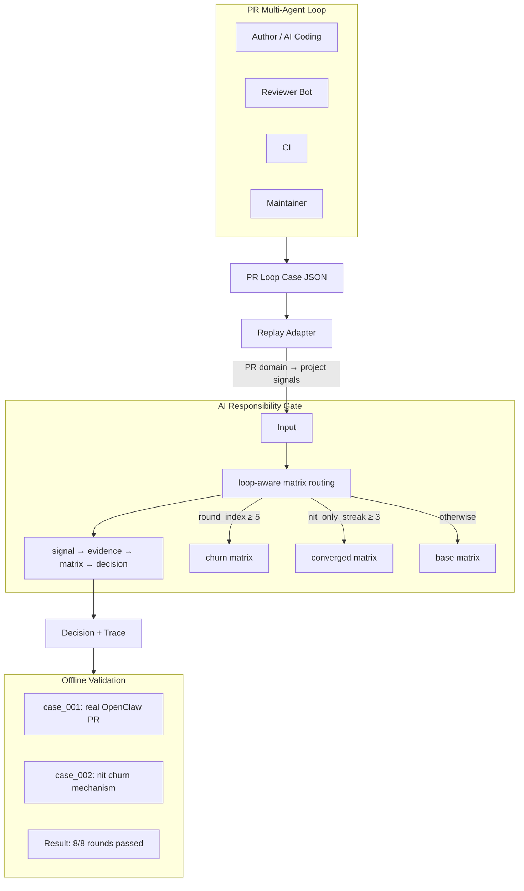
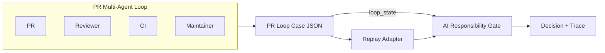

# PR Loop Replay 技术汇报

**AI Responsibility Gate – PR Loop Governance Architecture**

> 结构：一页总结（问题-抽象-机制-证明）→ 流程 → 治理架构 → 设计边界 → 规则控制 → 多域验证 → 结果表 → 讲稿 → 架构边界问答。
> 精简版见 [PR_LOOP_REPLAY_BRIEFING_SUMMARY.md](PR_LOOP_REPLAY_BRIEFING_SUMMARY.md)。
>
> **建议**：在 GitHub 上查看以正确渲染 Mermaid 图。

**定位：** 这次汇报的重点，不是「如何做一个更聪明的 AI reviewer」，而是「如何给 AI reviewer / coding loop 增加一个确定性的治理裁决层」。

**背景：** AI Responsibility Gate 是责任中心化决策系统（signal → evidence → matrix → decision）。
本文不是在单独讨论 PR review 技巧，而是在 PR multi-agent loop 场景中验证 AI Responsibility Gate 这套治理骨架是否成立。PR loop 是第一个验证域；Permission domain 已验证该骨架可跨 domain 复用。

**当前实现状态：** 当前设计不是停留在概念层，已完成最小实现并在本地跑通：

- PR loop replay 已可执行
- loop-aware matrix routing 已生效
- case / matrix / adapter / gate 已贯通
- 当前样例集下 PR loop 8/8、Permission 2/2 与预期一致

---

## 1. 一页总结（架构师版）



### 要解决的问题

AI coding 时代，PR 已经变成 Author / Reviewer / CI / Maintainer 共同参与的 multi-agent loop。
问题不在「AI 能不能 review」，而在：

- reviewer loop 容易反复 churn
- AI 对 pass/fail 的判断不稳定
- 人工若对全部 PR 做同层级把关，无法扩展

### 核心设计

将「发现问题」和「做裁决」拆开：

| 角色 | 职责 |
|------|------|
| AI / 工具链 | 产出 signal |
| Gate | 做 signal → evidence → matrix → decision |

即：**AI 提供风险信号，Gate 负责确定性裁决**。

### 这次新增的能力

PR 不是单轮判断，而是循环状态判断。因此引入 **loop-aware matrix routing**：

| 条件 | 矩阵 |
|------|------|
| round_index ≥ 5 | churn matrix（优先） |
| nit_only_streak ≥ 3 | converged matrix |
| 其他 | base matrix |

> **优先级**：若同时满足 round_index ≥ 5 与 nit_only_streak ≥ 3，优先使用 churn matrix。

### 当前验证状态

本地已实现最小闭环并跑通：

| 验证项 | 结果 |
|--------|------|
| PR loop replay | 8/8 rounds 符合预期 |
| Permission replay | 2/2 符合预期 |
| 全量测试 | 116 passed |

**结论：** PR loop 证明了这套 Gate 不只是单点准入（只对单次进入做决策），而可以演进为跨 domain 的 agent governance decision layer，支持循环状态治理。

---

## 2. PR 循环执行流程



**流程说明：**

| # | 阶段 | 说明 |
|---|------|------|
| 1 | PR / Reviewer / CI / Maintainer | 真实 PR 场景中的多 agent 参与方 |
| 2 | Case JSON | `cases/pr_loop_real/*.json`，离线结构化输入 |
| 3 | Replay Adapter | PR 域信号 → 项目信号映射，round → DecisionRequest |
| 4 | AI Responsibility Gate | loop-aware matrix routing，根据 loop_state 切换矩阵 |
| 5 | Decision + Trace | 决策（ALLOW / ONLY_SUGGEST / HITL）及 effective_matrix 等 |

**loop_state 来源：** loop_state 由 replay/runtime context 维护，作为 decision request 的一部分传入 Gate。
Replay 场景下由 case JSON 的 `rounds[].loop_state` 提供；生产环境由 agent 运行时维护并传入。
Gate 为 Stateless：不存储 PR 状态，由 Replay 或 Runtime 提供「真相」，降低 Gate 维护成本与分布式一致性复杂度。

**信任边界（新增）：** Replay 场景：loop_state 来自 case JSON，可视为可信输入。Production 场景：loop_state 由 agent runtime 提供，若 runtime 不可信，应通过 runtime 层或 observability / audit 系统进行状态校验。目的：避免读者误解 Gate 在生产环境中直接信任 runtime。

**loop_state 结构：** `loop_state = { round_index, nit_only_streak }`。

`round_index` 表示当前 review 轮次；`nit_only_streak` 表示连续低价值 review 轮次数。二者构成 loop routing 的数据基础。

---

## 3. 治理架构模型

系统当前采用三层治理架构：Signal Layer、Evidence Providers、AI Responsibility Gate。
Signal domain 指一类治理场景：产生 domain-specific 信号，但共享同一决策模型。
PR loop 是当前第一个完成验证的 signal domain；新 domain 通过 Signal + EvidenceProvider 接入，Gate 核心保持不变。

| 层级 | 说明 |
|------|------|
| **Signal Layer** | `(domain, signal_type, payload)`。Gate 不解析 payload。 |
| **Evidence Providers** | 插件式：`EvidenceProvider.supports(signal)`、`evaluate(signal)` → `GovernanceEvidence`。 |
| **AI Responsibility Gate** | 只依赖 evidence 标准字段（risk_level, action_type, scope_level, verifiability）。 |

**GovernanceEvidence schema（Gate 依赖的稳定 schema，非 domain signal）：**

| 字段 | 说明 |
|------|------|
| risk_level | governance risk classification（R0–R3） |
| action_type | suggested governance action（READ / WRITE / …） |
| scope_level | permission scope or impact level |
| verifiability | whether the claim can be externally verified |

Evidence schema 预留 verifiability 字段，用于表示某类信号是否可被自动验证。
策略矩阵可基于该字段扩展治理策略，例如将不可验证信号升级为 HITL 或 ONLY_SUGGEST。

**示例（Gate 实际消费的 evidence 结构，PR domain）：**

```json
{
  "risk_level": "R2",
  "action_type": "READ",
  "scope_level": null,
  "verifiability": true
}
```

该归一化结构是 Gate 决策流程（signal → evidence → matrix → decision）所消费的稳定接口，与具体 domain 无关。

### 为什么需要这一抽象

**为什么不是 Signal → Gate？** Signal 承载各 domain 原始语义（review_bug、scope_request、tool_call），形式各异。
Gate 直接解析 signal 则每新增 domain 即需改 Gate；Evidence 提供标准字段，Gate 与 domain 解耦。

**Evidence 作为治理语义层：** Evidence 将不同 domain 的信号归一为稳定的治理决策输入。
各 domain 语义由 EvidenceProvider 归一为治理语义（risk_level、action_type、scope_level、verifiability），类似 OPA / Envoy 的 input normalization。

**策略稳定性与扩展性：** Gate 只依赖 evidence 标准字段，domain 扩展仅在 EvidenceProvider 层，Gate 核心不变。
新 domain 实现 Signal + EvidenceProvider 即可接入，PR 与 Permission 已验证该路径。

---

## 4. 设计边界

| 组件 | 职责边界 |
|------|----------|
| **Gate** | 唯一裁决点。只做 signal → evidence → matrix → decision。不关心信号来自 PR 还是其他域。loop_state 由 context 传入，仅用于 matrix routing，不参与业务规则。 |
| **Adapter** | PR 域 → 项目域转换。负责信号映射、DecisionRequest 构造。不参与决策逻辑，不改 core。 |
| **Replay** | 读 case、调 adapter、调 decide、输出结果。编排层，不承载业务规则。 |

Adapter 仅负责格式转换（JSON → Signal、round → DecisionRequest）；
EvidenceProvider 负责语义归一化（signal → GovernanceEvidence，如 risk_level、verifiability）；
Matrix 根据 evidence 执行治理策略（decision）。
Adapter 是「搬运层」，EvidenceProvider 是「语义归一层」，Matrix 是「决策层」。

---

## 5. 规则复杂度控制

| 机制 | 说明 |
|------|------|
| **规则在矩阵中** | 规则写在 YAML 矩阵，不在代码里。新增场景优先扩展矩阵或 adapter 映射，Gate 核心逻辑不变。 |
| **Routing 而非规则** | loop-aware routing 只决定「选哪个矩阵」，不决定「加什么规则」。矩阵数量有限（base / converged / churn），不随场景线性增长。**优先级**：round_index ≥ 5 优先于 nit_only_streak ≥ 3（同时满足时用 churn matrix）。Routing 根据 loop_state 选择适用的 policy matrix，随后 pipeline 在该矩阵下评估 evidence。 |
| **Adapter 隔离域** | PR 工具链（Greptile、CodeRabbit 等）信号各异，adapter 做映射，catalog 和 Gate 保持稳定。 |

**Loop governance 通用性：** PR loop governance 是 agent loop governance 的一类实例；
nit_only_streak、round_index 等机制可泛化至 AI coding loop、tool retry loop、planner-executor loop 等场景。

---

## 6. 多域验证

系统已完成多 domain 验证。**AI Responsibility Gate 当前已验证其作为 governance decision engine 的成立性**，后续有演进为更完整治理控制面的可能。
Gate 集中治理决策、策略外置，在架构上具备 control plane 的典型特征。

### 实现部件清单

当前方案已完成最小实现并在本地跑通，包含以下部件：

| 部件 | 说明 |
|------|------|
| Gate core | signal → evidence → matrix → decision |
| loop-aware matrix routing | 根据 loop_state 选矩阵 |
| replay runner | PR loop / Permission 离线重放 |
| PR loop case schema | `cases/pr_loop_real/*.json` |
| adapter | PR 信号 → 治理信号映射 |
| matrix 配置 | pr_loop_demo / churn / phase_e / permission_demo |
| permission domain | 最小接入验证 |

**当前验证目标**不是生产可用性，而是验证：Gate 抽象是否可执行、loop_state 是否能稳定驱动矩阵切换、domain 接入是否不需要修改 Gate core、策略是否可通过 replay 做回归验证。

| Domain | 状态 | 说明 |
|--------|------|------|
| **Domain 1: PR loop governance** | 已验证 | loop-aware matrix routing，8/8 rounds replay 通过 |
| **Domain 2: Permission governance** | 已验证 | scope_request → risk_level，2/2 rounds replay 通过 |

**Cross-domain risk normalization：** 各 domain 风险语义由对应 EvidenceProvider 按统一治理风险分级规范映射到 risk_level scale（R0–R3）；
进入 Gate 前已完成归一化，可比较。

### 治理风险分级

R0–R3 表示**操作副作用等级（Operational Side-effect Level）**，不是 domain 语义。
各 domain 的 EvidenceProvider 必须按此标准映射。

| 等级 | 定义 | 示例 |
|------|------|------|
| R0 | 无副作用操作 | 查询公开信息、读取日志 |
| R1 | 可逆且影响范围小 | 添加注释、修改文档 |
| R2 | 影响逻辑但存在自动兜底 | 修改业务代码但有单元测试 |
| R3 | 不可逆或影响系统安全/基础设施 | 权限变更、删除生产数据 |

> risk_level 表示 governance risk（操作副作用等级），而不是 domain-specific 语义，因此不同 domain 的 R2 可以在 Gate 中统一治理。

### 控制面边界说明

**定位：** 当前为 governance decision engine（策略裁决 + 策略配置化）。
完整 Control Plane 需补齐 runtime integration、policy distribution、observability、audit。
架构核心是将治理逻辑从业务代码中剥离：Policy as Code（矩阵配置）与 Loop as First-class Citizen（循环状态作为治理一等公民），为从单点准入演进至全生命周期轨迹治理奠定基础。

**当前已具备的能力：**

| 能力 | 状态 | 说明 |
|------|------|------|
| 策略裁决 | ✅ | Gate 作为唯一裁决点，signal → evidence → matrix → decision |
| 策略配置化 | ✅ | 规则在 YAML 矩阵中，可独立于代码演进 |
| 多 domain 接入 | ✅ | Signal + EvidenceProvider 插件式扩展 |
| 离线验证 | ✅ | Replay 支持 case 级策略验证 |

**未来待补充的能力：**

| 能力 | 说明 |
|------|------|
| Runtime integration | 与生产环境 agent 运行时集成，实时决策 |
| Observability | 决策 trace、metrics、审计日志的可观测性 |
| Policy distribution | 策略下发、版本管理、灰度发布 |
| 更多 domain | Tool governance、Hallucinated action verification 等 |

---

## 7. Replay 结果表

Replay 支持治理策略测试与回归验证，不干扰线上 agent 工作流（governance CI）。
策略变更后通过 replay 回归验证，确保决策行为符合预期。

**loop_state 格式：** `(round_index, nit_only_streak)`。

例：(3, 3) = 第 4 轮且连续 3 轮 nit-only；(5, 0) = 第 6 轮（case_002 用于 churn 教学，非连续循环）。

### case_001：真实案例（[OpenClaw PR #27286](https://github.com/openclaw/openclaw/pull/27286) — gateway remote token fallback）

| Round | loop_state | project_signals | effective_matrix | decision | expected | match |
|-------|------------|-----------------|-----------------|----------|----------|-------|
| 0 | (0, 0) | BUG_RISK | pr_loop_demo_v0.1 | ONLY_SUGGEST | ONLY_SUGGEST | ✓ |
| 1 | (1, 0) | BUG_RISK | pr_loop_demo_v0.1 | ONLY_SUGGEST | ONLY_SUGGEST | ✓ |
| 2 | (2, 0) | BUILD_CHAIN | pr_loop_demo_v0.1 | HITL | HITL | ✓ |

### case_002：机制案例（nit churn 教学）

| Round | loop_state | project_signals | effective_matrix | decision | expected | match |
|-------|------------|-----------------|-----------------|----------|----------|-------|
| 0 | (0, 0) | LOW_VALUE_NITS | pr_loop_demo_v0.1 | ONLY_SUGGEST | ONLY_SUGGEST | ✓ |
| 1 | (1, 1) | LOW_VALUE_NITS | pr_loop_demo_v0.1 | ONLY_SUGGEST | ONLY_SUGGEST | ✓ |
| 2 | (2, 2) | LOW_VALUE_NITS | pr_loop_demo_v0.1 | ONLY_SUGGEST | ONLY_SUGGEST | ✓ |
| 3 | (3, 3) | LOW_VALUE_NITS | pr_loop_phase_e_v0.1 | ALLOW | ALLOW | ✓ |
| 4 | (5, 0) | LOW_VALUE_NITS | pr_loop_churn_v0.1 | HITL | HITL | ✓ |

> **说明**：project_signals 是本项目的信号别名，来自 case 的 signals 经 adapter 映射；**实际决策输入**是 EvidenceProvider 归一后的 risk_level（R0–R3）。case_002 的 signals 为 LOW_VALUE_NITS（低价值 nit 类评论），映射为 R0。

**汇总：** 8 rounds，当前 replay 样例集下预期决策与实际决策一致（8/8）。

### Permission Domain（case_001_scope_read、case_002_scope_admin）

Permission domain 复用同一 project_signals 枚举，通过 EvidenceProvider 将 scope_request 映射到对应 risk_level。

| Case | scope_request | project_signals | decision | expected | match |
|------|---------------|-----------------|----------|----------|-------|
| case_001_scope_read | read | LOW_VALUE_NITS | ALLOW | ALLOW | ✓ |
| case_002_scope_admin | admin | BUILD_CHAIN | HITL | HITL | ✓ |

**汇总：** 2 rounds，当前 replay 样例集下预期决策与实际决策一致（2/2）。

### 总体汇总

| 域 | Rounds | 通过 | 说明 |
|----|--------|------|------|
| PR loop | 8 | 8/8 | case_001 + case_002 |
| Permission | 2 | 2/2 | case_001_scope_read + case_002_scope_admin |
| **Tests** | — | **116 passed** | 全量测试通过 |

**解读**：case_001 展示真实 PR loop 治理路径；
case_002 用于隔离验证 loop-aware routing；
Permission domain 验证 scope_request → risk_level → decision 的跨 domain 接入能力。
上述结果验证了当前 replay 数据集上的治理逻辑正确性，而非统计模型评估。

**Decision Trace 示例**（综合示例，非特指某 case）：

```json
{
  "decision": "HITL",
  "risk_level": "R3",
  "effective_matrix": "pr_loop_churn_v0.1",
  "trace": ["ci_failure", "maintainer_intervention"]
}
```

决策 trace 支持治理决策的可观测性与可审计性，为未来的 observability、audit、decision explainability 提供基础。

> **注**：case_002 中 project_signals 均为 LOW_VALUE_NITS（低风险 nit 类）。决策变化由 loop_state 驱动（nit_only_streak、round_index），而非 signal 风险等级，体现 routing 与 signal 语义解耦。

---

## 8. 2–3 分钟讲稿

**开场：**

> 我最近在做一个 AI 责任网关的扩展，想解决 AI coding 和 AI reviewer 多轮协作里的循环治理问题。

**问题：**

> 我发现真实 PR 里其实已经是多 agent 环境了：author、review bot、CI、maintainer 都在参与。如果每种情况都直接写规则，规则会快速膨胀。

**抽象：**

> 所以我没有把这些问题写成大量 if/else，而是继续沿用我原来的抽象：signal → evidence → matrix → gate decision。

**实现：**

> 这次我增加了一个 loop-aware matrix routing，让系统根据 loop_state 自动切换治理矩阵。比如：
>
> - nit_only_streak ≥ 3 时，切到 converged matrix，决策可以变成 ALLOW
> - round_index ≥ 5 时，切到 churn matrix，决策升级为 HITL

**验证：**

> 我做了两个 replay case：真实 OpenClaw PR 与教学型 reviewer loop case，8/8 rounds 通过。Permission domain 已验证（read→ALLOW、admin→HITL，2/2 通过），系统为多 domain 治理决策引擎。Replay 支持策略测试与回归验证（governance CI），不干扰线上 agent。

**收尾：**

> 这说明 AI coding / reviewer 多 agent 协作场景，以及更一般的 agent action governance 场景，都可以通过一个独立的治理裁决层来稳定运行。

**讲稿加餐（可选）：** 这套架构的核心是将治理逻辑从业务代码中剥离。我们不仅实现了 Policy as Code（矩阵配置），还实现了 Loop as First-class Citizen（将循环状态作为治理的一等公民）。这为未来从「单点准入」演进到「全生命周期轨迹治理」打下了基础。

---

## 9. 架构边界问答（8 个核心问题）

| # | 类别 | 问题 |
|---|------|------|
| 1 | 存在性 | 为什么需要独立的 Gate？ |
| 2 | 存在性 | 为什么不让 AI 直接 pass/fail？ |
| 3 | 信任 | 如果 runtime 提供的 loop_state 不可信怎么办？ |
| 4 | 架构 | 为什么要 Evidence layer？ |
| 5 | 架构 | 为什么 routing 不直接写进 matrix 条件？ |
| 6 | 扩展 | matrix 会不会爆炸？ |
| 7 | 运维 | 为什么要 replay？ |
| 8 | 方案 | 为什么这不是普通规则引擎 / OPA？ |

### 1. 为什么需要独立的 Gate？

多 Agent 协作时，若每个 Agent 自实现策略，治理逻辑会碎片化。Gate 将治理决策抽离为统一决策中心：Agent 负责执行行为，Gate 负责裁决行为。类似 API Gateway 或 K8s Admission Controller。

### 2. 为什么不让 AI 直接 pass/fail？

实践发现 AI reviewer 容易 nit picking、endless refinement、decision instability。一旦把「是否通过」交给 AI 自主判断，容易失控。Gate 的设计是：AI 只提供风险信号，Gate 用确定性规则裁决，决策权不在 AI。

### 3. 如果 runtime 提供的 loop_state 不可信怎么办？

这是刻意的 trade-off。若 Gate 自己维护执行态，它会从 decision engine 变成 workflow engine，边界会失控。因此 Gate 保持 stateless，但通过 replay / trace / audit 提供可验证性：**execution truth 在 runtime，governance truth 在 Gate + audit**。若 runtime 不可信，应在 runtime 层或 observability / audit 系统中进行状态校验。

### 4. 为什么要 Evidence layer？是不是过度设计？

因为 Gate 要跨 domain 复用。若直接消费 PR / Permission / Tool 原始 signal，Gate 核心会被 domain 侵蚀。Evidence layer 的作用不是增加复杂度，而是把 domain-specific 语义提前归一，**保护 Gate core 稳定**。

### 5. 为什么 routing 不直接写进 matrix 条件？

loop_state 决定「用哪套矩阵」，矩阵内规则决定「evidence 如何裁决」。若把 loop_state 写进矩阵条件，每套策略需重复定义大量条件，矩阵膨胀；routing 将「选策略」与「执行策略」分离，矩阵数量有限。

### 6. matrix 会不会爆炸？

Matrix 按 governance pattern 增长（base、converged、churn），不按 domain 增长。新增 domain 通常只需新增 EvidenceProvider，不必新增 matrix。

### 7. 为什么要 replay？

策略变更后，用历史 case 离线重跑，校验决策是否变化。相当于 **governance CI**，确保策略演进不破坏已有行为。传统 AI 系统少有这一能力。

### 8. 为什么这不是普通规则引擎 / OPA？

本系统并非单纯把 if/else 外置，而是针对 AI agent 场景增加了三层抽象：**Signal / Evidence 解耦**（吸收 AI / reviewer / tool 的异构语义）、**Loop-aware routing**（将循环状态纳入治理上下文）、**Replay-based validation**（策略变更可通过历史 case 回归验证）。因此它更接近于 AI agent 的治理裁决层，而非传统业务规则表。OPA 解决 authorization（谁访问什么资源）；本系统解决 agent 行为治理（loop churn、是否 HITL）。

---

## 10. 参考链接

### 汇报必读

| 资源 | 说明 |
|------|------|
| case_001 真实 PR | [openclaw/openclaw#27286](https://github.com/openclaw/openclaw/pull/27286) |
| [AI_AGENT_GOVERNANCE_ROADMAP.md](AI_AGENT_GOVERNANCE_ROADMAP.md) | 治理控制面 roadmap |
| [PR_LOOP_REAL_CASE_JSON_SCHEMA.md](PR_LOOP_REAL_CASE_JSON_SCHEMA.md) | Case 格式定义 |
| case_001 · case_002 | [pr_loop_real](https://github.com/zhangzhefang-github/ai-responsibility-gate/blob/main/cases/pr_loop_real/) · [permission_real](https://github.com/zhangzhefang-github/ai-responsibility-gate/blob/main/cases/permission_real/) |
| pr_loop_demo.yaml · permission_demo.yaml | [matrices/](https://github.com/zhangzhefang-github/ai-responsibility-gate/blob/main/matrices/) |

### 实现者参考

| 文档 | 说明 |
|------|------|
| [PR_LOOP_REAL_CASE_ADAPTER_DESIGN.md](PR_LOOP_REAL_CASE_ADAPTER_DESIGN.md) | Adapter 设计（PR 信号 → 项目信号） |
| [PERMISSION_GOVERNANCE_REFINED_DESIGN.md](PERMISSION_GOVERNANCE_REFINED_DESIGN.md) | Permission domain 最小实施设计 |

### 架构设计参考

| 文档 | 说明 |
|------|------|
| [LOOP_GOVERNANCE_CORE_MIGRATION_DESIGN.md](LOOP_GOVERNANCE_CORE_MIGRATION_DESIGN.md) | Loop 策略与 matrix routing 设计 |
