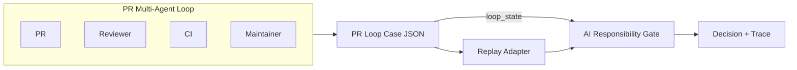

# PR Loop Replay 技术汇报

**AI Responsibility Gate – PR Loop Governance Architecture**

> 用于向老师/评审汇报 AI 责任网关的 PR 循环治理扩展。结构：一页架构总结 → 详细架构图 → 三层架构 → 职责边界 → 规则复杂度控制 → 多 domain 验证 → 结果表 → 讲稿 → Q&A。
>
> *建议在 GitHub 上查看以正确渲染 Mermaid 图。*

**背景：** AI Responsibility Gate 是责任中心化决策系统（signal → evidence → matrix → decision）。本文汇报其 PR 循环治理扩展：在 multi-agent PR 场景下，通过 loop-aware matrix routing 实现收敛与 churn 的自动切换，并用 replay 验证。

---

## 1. 一页架构总结（Page 1）


**五关键信息点：**

| # | Key Insight | Description |
|---|-------------|-------------|
| 1 | PR is multi-agent | Author, Reviewer, CI, Maintainer |
| 2 | Case JSON as contract | unified replay input |
| 3 | Adapter isolates domain | PR signals → governance signals |
| 4 | Gate as decision authority | signal → evidence → matrix → decision |
| 5 | Loop-aware routing | loop_state → matrix switching |

**1 分钟讲解话术：**

> 1. PR 在 AI coding 时代已经变成一个 multi-agent loop。  
> 2. 所以我把 PR 过程抽象成 Case JSON，然后通过 Adapter 转换成治理信号。  
> 3. 这些信号进入 AI Responsibility Gate，Gate 是唯一裁决点。  
> 4. Gate 内部使用 signal → evidence → matrix → decision 的治理模型。  
> 5. 我新增了 loop-aware matrix routing，根据 loop_state 切换治理策略。  
> 6. 我用两个 replay case 验证了这个机制，8/8 rounds 通过。

---

## 2. PR Loop Execution Flow



**流程说明：**

| 阶段 | 说明 |
|------|------|
| PR / Reviewer / CI / Maintainer | 真实 PR 场景中的多 agent 参与方 |
| Case JSON | `cases/pr_loop_real/*.json`，离线结构化输入 |
| Replay Adapter | PR 域信号 → 项目信号映射，round → DecisionRequest |
| AI Responsibility Gate | loop-aware matrix routing，根据 loop_state 切换矩阵 |
| Decision + Trace | 决策（ALLOW / ONLY_SUGGEST / HITL）及 effective_matrix 等 |

**loop_state 来源：** loop_state 由 replay/runtime context 维护，作为 decision request 的一部分传入 Gate。Replay 场景下由 case JSON 的 `rounds[].loop_state` 提供；生产环境由 agent 运行时维护并传入。Gate 为 Stateless：不存储 PR 状态，由 Replay 或 Runtime 提供「真相」，降低 Gate 维护成本与分布式一致性复杂度。

**loop_state 结构：** `loop_state = { round_index, nit_only_streak }`。`round_index` 表示当前 review 轮次；`nit_only_streak` 表示连续低价值 review 轮次数。二者构成 loop routing 的数据基础。

---

## 3. Governance Architecture Model

系统当前采用三层治理架构：Signal Layer、Evidence Providers、AI Responsibility Gate。Signal domain 指一类治理场景：产生 domain-specific 信号，但共享同一决策模型。PR loop 是当前第一个完成验证的 signal domain；新 domain 通过 Signal + EvidenceProvider 接入，Gate 核心保持不变。

| 层级 | 说明 |
|------|------|
| **Signal Layer** | `(domain, signal_type, payload)`。Gate 不解析 payload。 |
| **Evidence Providers** | 插件式：`EvidenceProvider.supports(signal)`、`evaluate(signal)` → `GovernanceEvidence`。 |
| **AI Responsibility Gate** | 只依赖 evidence 标准字段（risk_level, action_type, scope_level, verifiability）。 |

**GovernanceEvidence schema（Gate 依赖的稳定 schema，非 domain signal）：**

| field | description |
|-------|---------|
| risk_level | governance risk classification（R0–R3） |
| action_type | suggested governance action（READ / WRITE / …） |
| scope_level | permission scope or impact level |
| verifiability | whether the claim can be externally verified |

verifiability 字段可用于矩阵决策：矩阵可据此决定直接采信 Agent 结论，或强制进入 HITL 流程。

**示例（Gate 实际消费的 evidence 结构，PR domain）：**

```json
{
  "risk_level": "R2",
  "action_type": "READ",
  "scope_level": null,
  "verifiability": true
}
```

该归一化结构是 Gate 决策 pipeline 消费的稳定接口，与 domain 无关。

### Why this abstraction

**为什么不是 Signal → Gate？** Signal 承载各 domain 原始语义（review_bug、scope_request、tool_call），形式各异。Gate 直接解析 signal 则每新增 domain 即需改 Gate；Evidence 提供标准字段，Gate 与 domain 解耦。

**Evidence 作为治理语义层：** Evidence 将不同 domain 的信号归一为稳定的治理决策输入。各 domain 语义由 EvidenceProvider 归一为治理语义（risk_level、action_type、scope_level、verifiability），类似 OPA / Envoy 的 input normalization。

**策略稳定性与扩展性：** Gate 只依赖 evidence 标准字段，domain 扩展仅在 EvidenceProvider 层，Gate 核心不变。新 domain 实现 Signal + EvidenceProvider 即可接入，PR 与 Permission 已验证该路径。

---

## 4. Design Boundaries

| 组件 | 职责边界 |
|------|----------|
| **Gate** | 唯一裁决点。只做 signal → evidence → matrix → decision。不关心信号来自 PR 还是其他域。loop_state 由 context 传入，仅用于 matrix routing，不参与业务规则。 |
| **Adapter** | PR 域 → 项目域转换。负责信号映射、DecisionRequest 构造。不参与决策逻辑，不改 core。 |
| **Replay** | 读 case、调 adapter、调 decide、输出结果。编排层，不承载业务规则。 |

---

## 5. Why Rule Explosion Is Controlled

| 机制 | 说明 |
|------|------|
| **规则在矩阵中** | 规则写在 YAML 矩阵，不在代码里。新增场景优先扩展矩阵或 adapter 映射，Gate 核心逻辑不变。 |
| **Routing 而非规则** | loop-aware routing 只决定「选哪个矩阵」，不决定「加什么规则」。矩阵数量有限（base / converged / churn），不随场景线性增长。Routing 为 context 选择当前最适用的规则集（override），选中的矩阵直接作用于 evidence。 |
| **Adapter 隔离域** | PR 工具链（Greptile、CodeRabbit 等）信号各异，adapter 做映射，catalog 和 Gate 保持稳定。 |

**Loop governance 通用性：** PR loop governance 是 agent loop governance 的一类实例；nit_only_streak、round_index 等机制可泛化至 AI coding loop、tool retry loop、planner-executor loop 等场景。

---

## 6. Multi-Domain Validation

系统已完成多 domain 验证，**AI Responsibility Gate 当前为 governance decision engine**，可演进为完整 Control Plane。Gate 集中治理决策、策略外置，符合 control plane 典型特征。

| Domain | 状态 | 说明 |
|--------|------|------|
| **Domain 1: PR loop governance** | 已验证 | loop-aware matrix routing，8/8 rounds replay 通过 |
| **Domain 2: Permission governance** | 已验证 | scope_request → risk_level，2/2 rounds replay 通过 |

**Cross-domain risk normalization：** 各 domain 风险语义由对应 EvidenceProvider 按统一治理风险分级规范映射到 risk_level scale（R0–R3），进入 Gate 前已完成归一化，可比较。

### Control Plane 边界说明

**定位：** 当前为 governance decision engine（策略裁决 + 策略配置化）。完整 Control Plane 需补齐 runtime integration、policy distribution、observability、audit。架构核心是将治理逻辑从业务代码中剥离：Policy as Code（矩阵配置）与 Loop as First-class Citizen（循环状态作为治理一等公民），为从单点准入演进至全生命周期轨迹治理奠定基础。

**当前已具备的能力：**

| 能力 | 状态 | 说明 |
|------|------|------|
| 策略裁决 | ✅ | Gate 作为唯一裁决点，signal → evidence → matrix → decision |
| 策略配置化 | ✅ | 规则在 YAML 矩阵中，可独立于代码演进 |
| 多 domain 接入 | ✅ | Signal + EvidenceProvider 插件式扩展 |
| 离线验证 | ✅ | Replay 支持 case 级策略验证 |

**未来待补充的能力：**

| 能力 | 说明 |
|------|------|
| Runtime integration | 与生产环境 agent 运行时集成，实时决策 |
| Observability | 决策 trace、metrics、审计日志的可观测性 |
| Policy distribution | 策略下发、版本管理、灰度发布 |
| 更多 domain | Tool governance、Hallucinated action verification 等 |

---

## 7. Replay 结果表

Replay 支持治理策略测试与回归验证，不干扰线上 agent 工作流（governance CI）。策略变更后通过 replay 回归验证，确保决策行为符合预期。

**loop_state 格式：** `(round_index, nit_only_streak)`。例：(3, 3) = 第 4 轮且连续 3 轮 nit-only；(5, 0) = 第 6 轮（case_002 用于 churn 教学，非连续循环）。

### case_001：真实案例（[OpenClaw PR #27286](https://github.com/openclaw/openclaw/pull/27286) — gateway remote token fallback）

| Round | loop_state | project_signals | effective_matrix | decision | expected | match |
|-------|------------|-----------------|-----------------|----------|----------|-------|
| 0 | (0, 0) | BUG_RISK | pr_loop_demo_v0.1 | ONLY_SUGGEST | ONLY_SUGGEST | ✓ |
| 1 | (1, 0) | BUG_RISK | pr_loop_demo_v0.1 | ONLY_SUGGEST | ONLY_SUGGEST | ✓ |
| 2 | (2, 0) | BUILD_CHAIN | pr_loop_demo_v0.1 | HITL | HITL | ✓ |

### case_002：机制案例（nit churn 教学）

| Round | loop_state | project_signals | effective_matrix | decision | expected | match |
|-------|------------|-----------------|-----------------|----------|----------|-------|
| 0 | (0, 0) | LOW_VALUE_NITS | pr_loop_demo_v0.1 | ONLY_SUGGEST | ONLY_SUGGEST | ✓ |
| 1 | (1, 1) | LOW_VALUE_NITS | pr_loop_demo_v0.1 | ONLY_SUGGEST | ONLY_SUGGEST | ✓ |
| 2 | (2, 2) | LOW_VALUE_NITS | pr_loop_demo_v0.1 | ONLY_SUGGEST | ONLY_SUGGEST | ✓ |
| 3 | (3, 3) | LOW_VALUE_NITS | pr_loop_phase_e_v0.1 | ALLOW | ALLOW | ✓ |
| 4 | (5, 0) | LOW_VALUE_NITS | pr_loop_churn_v0.1 | HITL | HITL | ✓ |

*project_signals 来自 case 的 signals 经 adapter（Signal → EvidenceProvider → risk_level）映射后的结果。case_002 的 signals 为 LOW_VALUE_NITS（低价值 nit 类评论），映射为 R0 → LOW_VALUE_NITS。*

**汇总：** 8 rounds，当前 replay 样例集下预期决策与实际决策一致（8/8）。

### Permission Domain（case_001_scope_read、case_002_scope_admin）

| Case | scope_request | project_signals | decision | expected | match |
|------|---------------|-----------------|----------|----------|-------|
| case_001_scope_read | read | LOW_VALUE_NITS | ALLOW | ALLOW | ✓ |
| case_002_scope_admin | admin | BUILD_CHAIN | HITL | HITL | ✓ |

**汇总：** 2 rounds，当前 replay 样例集下预期决策与实际决策一致（2/2）。

### 总体汇总

| 域 | Rounds | 通过 | 说明 |
|----|--------|------|------|
| PR loop | 8 | 8/8 | case_001 + case_002 |
| Permission | 2 | 2/2 | case_001_scope_read + case_002_scope_admin |
| **Tests** | — | **116 passed** | 全量测试通过 |

**Interpretation：** case_001 展示真实 PR loop 治理路径；case_002 用于隔离验证 loop-aware routing；Permission domain 验证 scope_request → risk_level → decision 的跨 domain 接入能力。These results demonstrate correctness of the governance logic on the current replay dataset, rather than statistical model evaluation.

**Decision Trace 示例：**

```json
{
  "decision": "HITL",
  "risk_level": "R3",
  "effective_matrix": "pr_loop_churn_v0.1",
  "trace": ["ci_failure", "maintainer_intervention"]
}
```

决策 trace 支持治理决策的可观测性与可审计性，为未来的 observability、audit、decision explainability 提供基础。

*注：case_002 中 project_signals 均为 LOW_VALUE_NITS（低风险 nit 类）。决策变化由 loop_state 驱动（nit_only_streak、round_index），而非 signal 风险等级，体现 routing 与 signal 语义解耦。*

---

## 8. 2–3 分钟讲稿

**开场：**

> 我最近在做一个 AI 责任网关的扩展，想解决 AI coding 和 AI reviewer 多轮协作里的循环治理问题。

**问题：**

> 我发现真实 PR 里其实已经是多 agent 环境了：author、review bot、CI、maintainer 都在参与。如果每种情况都直接写规则，规则会快速膨胀。

**抽象：**

> 所以我没有把这些问题写成大量 if/else，而是继续沿用我原来的抽象：signal → evidence → matrix → gate decision。

**实现：**

> 这次我增加了一个 loop-aware matrix routing，让系统根据 loop_state 自动切换治理矩阵。比如：
>
> - nit_only_streak ≥ 3 时，切到 converged matrix，决策可以变成 ALLOW
> - round_index ≥ 5 时，切到 churn matrix，决策升级为 HITL

**验证：**

> 我做了两个 replay case：真实 OpenClaw PR 与教学型 reviewer loop case，8/8 rounds 通过。Permission domain 已验证（read→ALLOW、admin→HITL，2/2 通过），系统为多 domain 治理决策引擎。Replay 支持策略测试与回归验证（governance CI），不干扰线上 agent。

**收尾：**

> 这说明 AI coding / reviewer 多 agent 协作场景，以及更一般的 agent action governance 场景，都可以通过责任网关进行治理，而不需要改变原有工具链。

**讲稿加餐（可选）：** 这套架构的核心是将治理逻辑从业务代码中剥离。我们不仅实现了 Policy as Code（矩阵配置），还实现了 Loop as First-class Citizen（将循环状态作为治理的一等公民）。这为未来从「单点准入」演进到「全生命周期轨迹治理」打下了基础。

---

## 9. 如果我是评审，我会问你什么

| 问题 | 答案 |
|------|------|
| 为什么不直接写规则？ | 规则数量会增长，但复杂度应该限制在 policy 层，而不是 core。 |
| 为什么要 replay？ | Replay 支持治理策略测试与回归验证，不干扰线上 agent；相当于 governance CI。 |
| 未来怎么扩展？ | 新的 PR 工具链只需要 adapter。Gate core 不变。 |
| 是否只支持 PR？ | 否。Permission domain 已验证（2/2 通过），Gate 核心未改，多 domain 扩展路径成立。 |
| 不同 domain 的 risk_level 是否可比较？ | 是。各 EvidenceProvider 将 domain 原生风险映射到统一的 risk_level scale（R0–R3），进入 Gate 前已完成归一化。 |
| 为什么 Evidence 不是 policy layer？ | Evidence 层负责将 domain signal 归一为治理语义，policy 层负责根据标准化 evidence 做裁决。前者解决语义归一化，后者解决决策规则，两者职责不同。 |
| loop_state 为什么不算业务规则？ | loop_state 只作为 routing context 决定选用哪套矩阵，不直接表达 domain 业务语义；具体决策规则仍由矩阵中的 policy 定义。 |
| 为什么要 Evidence layer？ | To decouple domain signals from governance policy。 |
| 为什么不用 OPA？ | OPA focuses on authorization policy；本系统 governs agent behavior loops，职责不同。 |
| 为什么需要 matrix？ | To externalize governance rules into versioned policy artifacts。 |
| Matrix 版本的平滑切换怎么做？ | Matrix 为 versioned YAML，存于 Git 或配置中心。通过 Decision Request 中的版本标签实现灰度切换，Replay 机制确保新版本矩阵不会导致存量 Case 逻辑崩坏。 |
| 性能开销如何？会成为瓶颈吗？ | Gate 为轻量级 pipeline，不涉及复杂推理（推理已在 Evidence Provider 阶段完成），核心仅做矩阵匹配，延迟在毫秒级。 |

---

## 10. 参考链接

### 汇报必读

| 资源 | 说明 |
|------|------|
| case_001 真实 PR | [openclaw/openclaw#27286](https://github.com/openclaw/openclaw/pull/27286) |
| [AI_AGENT_GOVERNANCE_ROADMAP.md](AI_AGENT_GOVERNANCE_ROADMAP.md) | 治理控制面 roadmap |
| [PR_LOOP_REAL_CASE_JSON_SCHEMA.md](PR_LOOP_REAL_CASE_JSON_SCHEMA.md) | Case 格式定义 |
| case_001 · case_002 | [pr_loop_real](https://github.com/zhangzhefang-github/ai-responsibility-gate/blob/main/cases/pr_loop_real/) · [permission_real](https://github.com/zhangzhefang-github/ai-responsibility-gate/blob/main/cases/permission_real/) |
| pr_loop_demo.yaml · permission_demo.yaml | [matrices/](https://github.com/zhangzhefang-github/ai-responsibility-gate/blob/main/matrices/) |

### 实现者参考

| 文档 | 说明 |
|------|------|
| [PR_LOOP_REAL_CASE_ADAPTER_DESIGN.md](PR_LOOP_REAL_CASE_ADAPTER_DESIGN.md) | Adapter 设计（PR 信号 → 项目信号） |
| [PERMISSION_GOVERNANCE_REFINED_DESIGN.md](PERMISSION_GOVERNANCE_REFINED_DESIGN.md) | Permission domain 最小实施设计 |

### 架构设计参考

| 文档 | 说明 |
|------|------|
| [LOOP_GOVERNANCE_CORE_MIGRATION_DESIGN.md](LOOP_GOVERNANCE_CORE_MIGRATION_DESIGN.md) | Loop 策略与 matrix routing 设计 |
