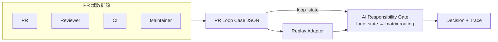

# PR Loop Replay 技术汇报

> 用于向老师/评审汇报 AI 责任网关的 PR 循环治理扩展。结构：架构图 → 职责边界 → 规则控制 → 结果表 → 讲稿。

---

## 1. PR Loop 架构图

**流程说明：**

| 阶段 | 说明 |
|------|------|
| PR / Reviewer / CI / Maintainer | 真实 PR 场景中的多 agent 参与方 |
| Case JSON | `cases/pr_loop_real/*.json`，离线结构化输入 |
| Replay Adapter | PR 域信号 → 项目信号映射，round → DecisionRequest |
| AI Responsibility Gate | loop-aware matrix routing，根据 loop_state 切换矩阵 |
| Decision + Trace | 决策（ALLOW / ONLY_SUGGEST / HITL）及 effective_matrix 等 |

---

## 2. Design Boundaries

| 组件 | 职责边界 |
|------|----------|
| **Gate** | 唯一裁决点。只做 signal → evidence → matrix → decision。不关心信号来自 PR 还是其他域。loop_state 由 context 传入，仅用于 matrix routing，不参与业务规则。 |
| **Adapter** | PR 域 → 项目域转换。负责信号映射、DecisionRequest 构造。不参与决策逻辑，不改 core。 |
| **Replay** | 读 case、调 adapter、调 decide、输出结果。编排层，不承载业务规则。 |

---

## 3. Why Rule Explosion Is Controlled

| 机制 | 说明 |
|------|------|
| **规则在矩阵中** | 规则写在 YAML 矩阵，不在代码里。新增场景优先扩展矩阵或 adapter 映射，Gate 核心逻辑不变。 |
| **Routing 而非规则** | loop-aware routing 只决定「选哪个矩阵」，不决定「加什么规则」。矩阵数量有限（base / converged / churn），不随场景线性增长。 |
| **Adapter 隔离域** | PR 工具链（Greptile、CodeRabbit 等）信号各异，adapter 做映射，catalog 和 Gate 保持稳定。 |

---

## 4. Replay 结果表

### case_001：真实案例（OpenClaw 远程 token fallback）

| Round | loop_state | project_signals | effective_matrix | decision | expected | match |
|-------|------------|-----------------|-----------------|----------|----------|-------|
| 0 | (0, 0) | BUG_RISK | pr_loop_demo_v0.1 | ONLY_SUGGEST | ONLY_SUGGEST | ✓ |
| 1 | (1, 0) | BUG_RISK | pr_loop_demo_v0.1 | ONLY_SUGGEST | ONLY_SUGGEST | ✓ |
| 2 | (2, 0) | BUILD_CHAIN | pr_loop_demo_v0.1 | HITL | HITL | ✓ |

### case_002：机制案例（nit churn 教学）

| Round | loop_state | project_signals | effective_matrix | decision | expected | match |
|-------|------------|-----------------|-----------------|----------|----------|-------|
| 0 | (0, 0) | UNKNOWN_SIGNAL | pr_loop_demo_v0.1 | ONLY_SUGGEST | ONLY_SUGGEST | ✓ |
| 1 | (1, 1) | UNKNOWN_SIGNAL | pr_loop_demo_v0.1 | ONLY_SUGGEST | ONLY_SUGGEST | ✓ |
| 2 | (2, 2) | UNKNOWN_SIGNAL | pr_loop_demo_v0.1 | ONLY_SUGGEST | ONLY_SUGGEST | ✓ |
| 3 | (3, 3) | UNKNOWN_SIGNAL | pr_loop_phase_e_v0.1 | ALLOW | ALLOW | ✓ |
| 4 | (5, 0) | UNKNOWN_SIGNAL | pr_loop_churn_v0.1 | HITL | HITL | ✓ |

**汇总：** 8 rounds，8/8 通过，Accuracy 100%。

**Interpretation:** case_001 demonstrates real-world PR loop governance; case_002 isolates loop-aware routing behavior.

---

## 5. 2–3 分钟讲稿

**开场：**

> 我最近在做一个 AI 责任网关的扩展，想解决 AI coding 和 AI reviewer 多轮协作里的循环治理问题。

**问题：**

> 我发现真实 PR 里其实已经是多 agent 环境了：author、review bot、CI、maintainer 都在参与。如果每种情况都直接写规则，规则会快速膨胀。

**抽象：**

> 所以我没有把这些问题写成大量 if/else，而是继续沿用我原来的抽象：signal → evidence → matrix → gate decision。

**实现：**

> 这次我增加了一个 loop-aware matrix routing，让系统根据 loop_state 自动切换治理矩阵。比如：
>
> - nit_only_streak >= 3 时，切到 converged matrix，决策可以变成 ALLOW
> - round_index >= 5 时，切到 churn matrix，决策升级为 HITL

**验证：**

> 我现在已经做了两个 replay case：一个是真实 OpenClaw PR，一个是教学型 reviewer loop case。目前 8/8 rounds replay 全部通过。

**收尾：**

> 这说明 AI coding / reviewer 多 agent 协作场景，可以通过责任网关进行治理，而不需要改变原有工具链。

---

## 6. 如果我是评审，我会问你什么

| 问题 | 答案 |
|------|------|
| 为什么不直接写规则？ | 规则数量会增长，但复杂度应该限制在 policy 层，而不是 core。 |
| 为什么要 replay？ | Replay 可以用真实案例验证治理策略，而不影响线上 PR。 |
| 未来怎么扩展？ | 新的 PR 工具链只需要 adapter。Gate core 不变。 |
