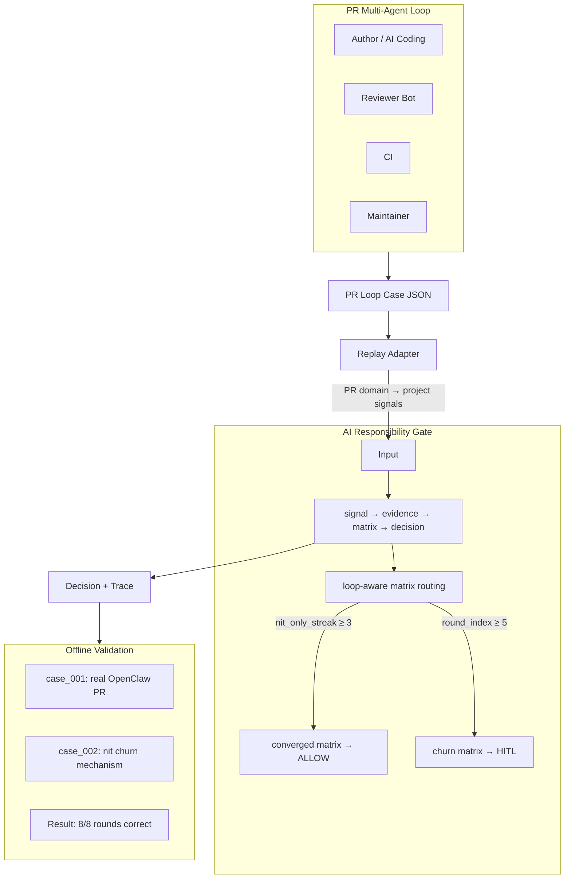
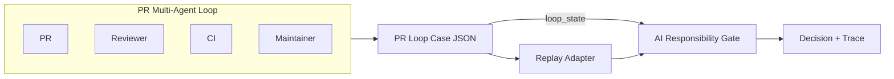

# PR Loop Replay 技术汇报

**AI Responsibility Gate – PR Loop Governance Architecture**

> 用于向老师/评审汇报 AI 责任网关的 PR 循环治理扩展。结构：一页架构总结 → 详细架构图 → 职责边界 → 规则控制 → 结果表 → 讲稿 → Q&A。
>
> *建议在 GitHub 上查看以正确渲染 Mermaid 图。*

**背景：** AI Responsibility Gate 是责任中心化决策系统（signal → evidence → matrix → decision）。本文汇报其 PR 循环治理扩展：在 multi-agent PR 场景下，通过 loop-aware matrix routing 实现收敛与 churn 的自动切换，并用 replay 验证。

---

## 1. 一页架构总结（Page 1）

**五关键信息点：**

| # | Key Insight | Description |
|---|-------------|-------------|
| 1 | PR is multi-agent | Author, Reviewer, CI, Maintainer |
| 2 | Case JSON as contract | unified replay input |
| 3 | Adapter isolates domain | PR signals → governance signals |
| 4 | Gate as decision authority | signal → evidence → matrix → decision |
| 5 | Loop-aware routing | loop_state → matrix switching |

**1 分钟讲解话术：**

> 1. PR 在 AI coding 时代已经变成一个 multi-agent loop。  
> 2. 所以我把 PR 过程抽象成 Case JSON，然后通过 Adapter 转换成治理信号。  
> 3. 这些信号进入 AI Responsibility Gate，Gate 是唯一裁决点。  
> 4. Gate 内部使用 signal → evidence → matrix → decision 的治理模型。  
> 5. 我新增了 loop-aware matrix routing，根据 loop_state 切换治理策略。  
> 6. 我用两个 replay case 验证了这个机制，目前 8/8 rounds 正确。

---

## 2. PR Loop Execution Flow

**流程说明：**

| 阶段 | 说明 |
|------|------|
| PR / Reviewer / CI / Maintainer | 真实 PR 场景中的多 agent 参与方 |
| Case JSON | `cases/pr_loop_real/*.json`，离线结构化输入 |
| Replay Adapter | PR 域信号 → 项目信号映射，round → DecisionRequest |
| AI Responsibility Gate | loop-aware matrix routing，根据 loop_state 切换矩阵 |
| Decision + Trace | 决策（ALLOW / ONLY_SUGGEST / HITL）及 effective_matrix 等 |

---

## 3. Design Boundaries

| 组件 | 职责边界 |
|------|----------|
| **Gate** | 唯一裁决点。只做 signal → evidence → matrix → decision。不关心信号来自 PR 还是其他域。loop_state 由 context 传入，仅用于 matrix routing，不参与业务规则。 |
| **Adapter** | PR 域 → 项目域转换。负责信号映射、DecisionRequest 构造。不参与决策逻辑，不改 core。 |
| **Replay** | 读 case、调 adapter、调 decide、输出结果。编排层，不承载业务规则。 |

---

## 4. Why Rule Explosion Is Controlled

| 机制 | 说明 |
|------|------|
| **规则在矩阵中** | 规则写在 YAML 矩阵，不在代码里。新增场景优先扩展矩阵或 adapter 映射，Gate 核心逻辑不变。 |
| **Routing 而非规则** | loop-aware routing 只决定「选哪个矩阵」，不决定「加什么规则」。矩阵数量有限（base / converged / churn），不随场景线性增长。 |
| **Adapter 隔离域** | PR 工具链（Greptile、CodeRabbit 等）信号各异，adapter 做映射，catalog 和 Gate 保持稳定。 |

---

## 5. Architecture Upgrade

系统已升级为三层治理架构，PR loop 是第一个接入的 signal domain。

| 层级 | 说明 |
|------|------|
| **Signal Layer** | `(domain, signal_type, payload)`。Gate 不解析 payload。 |
| **Evidence Providers** | 插件式：`EvidenceProvider.supports(signal)`、`evaluate(signal)` → `GovernanceEvidence`。 |
| **AI Responsibility Gate** | 只依赖 evidence 标准字段（risk_level, action_type, scope_level, verifiability）。 |

**要点：**

- Gate 只消费 evidence 标准字段，不直接理解具体 domain payload。
- PR loop 是第一个 signal domain（domain=pr，signal_type=review_bug/ci_failure/maintainer_intervention/nit_only）。
- 新 domain 通过 **Signal + EvidenceProvider** 接入，无需修改 Gate 核心。

### Why this abstraction

**为什么 Gate 只消费 evidence？** Signal 承载各 domain 的原始语义（如 PR 的 review_bug、permission 的 scope_request），形式各异。若 Gate 直接解析 signal，则每增加一个 domain 就要改 Gate，耦合度高。Evidence 提供 Gate 可消费的**标准字段**（risk_level, action_type, scope_level, verifiability），Gate 只依赖这些字段做裁决，与 domain 无关。

**Signal / Evidence / Gate 的解耦关系：** Signal 层负责「表达」，Evidence 层负责「转换」，Gate 层负责「裁决」。各层职责单一，domain 语义变化不会穿透到 Gate。

**这种分层如何支持多 domain 扩展？** 新 domain 只需实现 Signal 格式 + EvidenceProvider，将 domain 语义映射为 evidence 标准字段，即可接入现有 Gate pipeline，无需修改 Gate 核心。PR 与 Permission 两个 domain 的验证已证明该路径成立。

---

## 6. Multi-Domain Validation

系统已完成多 domain 验证，证明其不是 PR 专用 demo，而是 **AI Responsibility Gate / AI Agent Governance Control Plane** 的雏形。

| Domain | 状态 | 说明 |
|--------|------|------|
| **Domain 1: PR loop governance** | 已验证 | loop-aware matrix routing，8/8 rounds replay 通过 |
| **Domain 2: Permission governance** | 已验证 | scope_request → risk_level，2/2 rounds replay 通过 |

**要点：**

- 两个 domain 均通过 replay 离线验证，Gate 核心未改动。
- 新 domain 接入路径：Signal + EvidenceProvider → standardized governance inputs → 现有 Gate pipeline。
- 系统具备多 domain 扩展能力，可作为 AI Agent 治理控制面雏形。

### Control Plane 边界说明

**当前已具备的 Control Plane 能力：**

| 能力 | 状态 | 说明 |
|------|------|------|
| 策略裁决 | ✅ | Gate 作为唯一裁决点，signal → evidence → matrix → decision |
| 策略配置化 | ✅ | 规则在 YAML 矩阵中，可独立于代码演进 |
| 多 domain 接入 | ✅ | Signal + EvidenceProvider 插件式扩展 |
| 离线验证 | ✅ | Replay 支持 case 级策略验证 |

**未来待补充的能力：**

| 能力 | 说明 |
|------|------|
| Runtime integration | 与生产环境 agent 运行时集成，实时决策 |
| Observability | 决策 trace、metrics、审计日志的可观测性 |
| Policy distribution | 策略下发、版本管理、灰度发布 |
| 更多 domain | Tool governance、Hallucinated action verification 等 |

---

## 7. Replay 结果表

### case_001：真实案例（[OpenClaw PR #27286](https://github.com/openclaw/openclaw/pull/27286) — gateway remote token fallback）

| Round | loop_state | project_signals | effective_matrix | decision | expected | match |
|-------|------------|-----------------|-----------------|----------|----------|-------|
| 0 | (0, 0) | BUG_RISK | pr_loop_demo_v0.1 | ONLY_SUGGEST | ONLY_SUGGEST | ✓ |
| 1 | (1, 0) | BUG_RISK | pr_loop_demo_v0.1 | ONLY_SUGGEST | ONLY_SUGGEST | ✓ |
| 2 | (2, 0) | BUILD_CHAIN | pr_loop_demo_v0.1 | HITL | HITL | ✓ |

### case_002：机制案例（nit churn 教学）

| Round | loop_state | project_signals | effective_matrix | decision | expected | match |
|-------|------------|-----------------|-----------------|----------|----------|-------|
| 0 | (0, 0) | UNKNOWN_SIGNAL | pr_loop_demo_v0.1 | ONLY_SUGGEST | ONLY_SUGGEST | ✓ |
| 1 | (1, 1) | UNKNOWN_SIGNAL | pr_loop_demo_v0.1 | ONLY_SUGGEST | ONLY_SUGGEST | ✓ |
| 2 | (2, 2) | UNKNOWN_SIGNAL | pr_loop_demo_v0.1 | ONLY_SUGGEST | ONLY_SUGGEST | ✓ |
| 3 | (3, 3) | UNKNOWN_SIGNAL | pr_loop_phase_e_v0.1 | ALLOW | ALLOW | ✓ |
| 4 | (5, 0) | UNKNOWN_SIGNAL | pr_loop_churn_v0.1 | HITL | HITL | ✓ |

**汇总：** 8 rounds，8/8 通过，Accuracy 100%。

### Permission Domain（case_001_scope_read、case_002_scope_admin）

| Case | scope_request | project_signals | decision | expected | match |
|------|---------------|-----------------|----------|----------|-------|
| case_001_scope_read | read | LOW_VALUE_NITS | ALLOW | ALLOW | ✓ |
| case_002_scope_admin | admin | BUILD_CHAIN | HITL | HITL | ✓ |

**汇总：** 2 rounds，2/2 通过，Accuracy 100%。

### 总体汇总

| 域 | Rounds | 通过 | 说明 |
|----|--------|------|------|
| PR loop | 8 | 8/8 | case_001 + case_002 |
| Permission | 2 | 2/2 | case_001_scope_read + case_002_scope_admin |
| **Tests** | — | **116 passed** | 全量测试通过 |

**Interpretation:** case_001 demonstrates real-world PR loop governance (Greptile review → CI failure → maintainer intervention); case_002 isolates loop-aware routing behavior. Permission domain validates scope_request → risk_level → decision path with read→ALLOW, admin→HITL.

*Note: In case_002, LOW_VALUE_NITS is mapped to UNKNOWN_SIGNAL by the adapter for mechanism isolation (routing behavior is independent of signal semantics).*

---

## 8. 2–3 分钟讲稿

**开场：**

> 我最近在做一个 AI 责任网关的扩展，想解决 AI coding 和 AI reviewer 多轮协作里的循环治理问题。

**问题：**

> 我发现真实 PR 里其实已经是多 agent 环境了：author、review bot、CI、maintainer 都在参与。如果每种情况都直接写规则，规则会快速膨胀。

**抽象：**

> 所以我没有把这些问题写成大量 if/else，而是继续沿用我原来的抽象：signal → evidence → matrix → gate decision。

**实现：**

> 这次我增加了一个 loop-aware matrix routing，让系统根据 loop_state 自动切换治理矩阵。比如：
>
> - nit_only_streak ≥ 3 时，切到 converged matrix，决策可以变成 ALLOW
> - round_index ≥ 5 时，切到 churn matrix，决策升级为 HITL

**验证：**

> 我现在已经做了两个 replay case：一个是真实 OpenClaw PR，一个是教学型 reviewer loop case。目前 8/8 rounds replay 全部通过。此外，Permission domain 也已完成验证（read→ALLOW、admin→HITL，2/2 通过），证明系统不是 PR 专用，而是多 domain 治理控制面雏形。Replay allows offline validation of governance policies without interfering with live PR workflows.

**收尾：**

> 这说明 AI coding / reviewer 多 agent 协作场景，以及更一般的 agent action governance 场景，都可以通过责任网关进行治理，而不需要改变原有工具链。

---

## 9. 如果我是评审，我会问你什么

| 问题 | 答案 |
|------|------|
| 为什么不直接写规则？ | 规则数量会增长，但复杂度应该限制在 policy 层，而不是 core。 |
| 为什么要 replay？ | Replay 可以用真实案例验证治理策略，而不影响线上 PR。 |
| 未来怎么扩展？ | 新的 PR 工具链只需要 adapter。Gate core 不变。 |
| 是否只支持 PR？ | 否。Permission domain 已验证（2/2 通过），Gate 核心未改，证明多 domain 扩展路径成立。 |

---

## 10. 参考链接

### External Evidence

| 资源 | 链接 |
|------|------|
| case_001 真实 PR | [openclaw/openclaw#27286](https://github.com/openclaw/openclaw/pull/27286) |

### Core Docs

| 文档 | 说明 |
|------|------|
| [AI_AGENT_GOVERNANCE_ROADMAP.md](AI_AGENT_GOVERNANCE_ROADMAP.md) | 治理控制面 roadmap |
| [PERMISSION_GOVERNANCE_REFINED_DESIGN.md](PERMISSION_GOVERNANCE_REFINED_DESIGN.md) | Permission domain 最小实施设计 |
| [PR_LOOP_REAL_CASE_JSON_SCHEMA.md](PR_LOOP_REAL_CASE_JSON_SCHEMA.md) | Case 格式定义 |
| [PR_LOOP_REAL_CASE_ADAPTER_DESIGN.md](PR_LOOP_REAL_CASE_ADAPTER_DESIGN.md) | Adapter 设计（PR 信号 → 项目信号） |
| [LOOP_GOVERNANCE_CORE_MIGRATION_DESIGN.md](LOOP_GOVERNANCE_CORE_MIGRATION_DESIGN.md) | Loop 策略与 matrix routing 设计 |

### Replay Assets

| 资源 | 链接 |
|------|------|
| case_001 · case_002 | [pr_loop_real](https://github.com/zhangzhefang-github/ai-responsibility-gate/blob/main/cases/pr_loop_real/) · [permission_real](https://github.com/zhangzhefang-github/ai-responsibility-gate/blob/main/cases/permission_real/) |
| pr_loop_demo.yaml · permission_demo.yaml | [matrices/](https://github.com/zhangzhefang-github/ai-responsibility-gate/blob/main/matrices/) |
